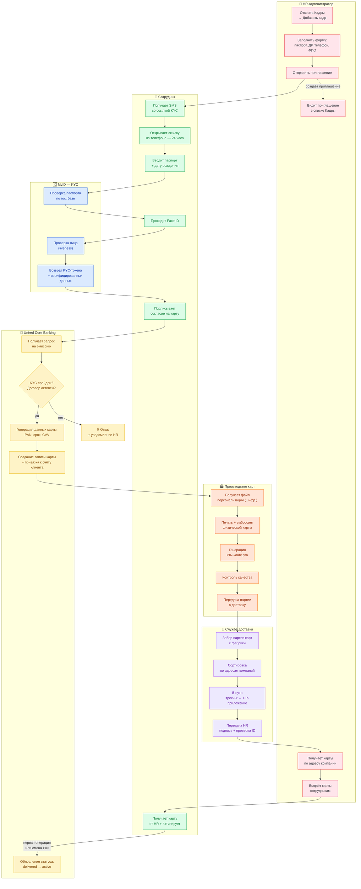

# Подключение сотрудника и выпуск зарплатной карты — Бизнес-процесс

**Продукт:** Unired Business · Зарплатный проект (модуль выплат)
**Владелец процесса:** HR-модуль + Операционный отдел (бэк-офис банка)
**Последнее обновление:** 2026-05-13
**Версия:** 1.0

---

## 1. Общее описание

Документ описывает, как HR-администратор корпоративного клиента приглашает нового сотрудника в зарплатный проект компании, как этот сотрудник проходит KYC удалённо через MyID, и как Unired Bank производит и доставляет физическую зарплатную карту по **адресу компании** (а не по домашнему адресу сотрудника — компания распределяет карты внутри коллектива).

**SLA полного цикла: 5–7 рабочих дней** от отправки приглашения HR-ом до получения карты на руки.

---

## 2. Участники

| Участник | Роль | Система / Точка контакта |
|---|---|---|
| **HR-администратор** | Владелец бизнеса / администратор зарплатного проекта | Мобильное приложение Unired Business |
| **Сотрудник** | Новый сотрудник, получающий зарплатную карту | Веб-ссылка на личном устройстве |
| **MyID** | Национальный сервис электронной идентификации (внешний) | MyID SDK / API |
| **Unired Core Banking** | Корбанковская система · жизненный цикл счетов и карт | Внутренний бэк-офис |
| **Производство карт** | Партнёр-фабрика (например, BPC, Thales) | Линия персонализации и эмбоссинга |
| **Служба доставки** | Курьерский партнёр (Express24, BTS, собственная) | Приложение курьера + API трекинга |

---

## 3. Диаграмма процесса (свимлейн)



> **Чтение диаграммы**: свимлейны сверху-вниз и слева-направо = зона ответственности участника.
> Сплошные стрелки = поток процесса. Пунктирные стрелки = побочный эффект (создание/обновление данных).

---

## 4. Пошаговое описание

### Фаза 1 · Приглашение (HR → Сотрудник) — минуты

| # | Шаг | Участник | Действие системы | Результат |
|---|---|---|---|---|
| 1 | Открыть Кадры → нажать **Добавить кадр** | HR | `staff.html` → `staff-add.html` | — |
| 2 | Заполнить форму (паспорт `AA1234567`, ДР `ДД.ММ.ГГГГ`, телефон `+998…`, ФИО) | HR | Клиентская валидация формы | Форма валидна |
| 3 | Нажать **Отправить приглашение** | HR | `MSB.createInvite()` — токен + 24-часовой срок; SMS-шлюз отправляет ссылку | Приглашение создано · статус `pending` |
| 4 | Увидеть приглашение в списке кадров | HR | `staff.html` читает приглашения из localStorage (в проде — бэкенд) | Закреплённый блок «Ожидают подтверждения (N)» |

### Фаза 2 · KYC (Сотрудник + MyID) — 3–10 минут

| # | Шаг | Участник | Действие системы | Результат |
|---|---|---|---|---|
| 5 | Открыть SMS-ссылку | Сотрудник | `kyc-welcome.html?token=…` проверяет токен и срок | Приветственный экран с названием компании |
| 6 | Ввести паспорт + ДР | Сотрудник | Сверка с данными приглашения — должны совпадать | Шаг 1 ✓ |
| 7 | Пройти Face ID | Сотрудник | MyID liveness check (повернуть голову, моргнуть) | Шаг 2 ✓ |
| 8 | Прочитать и принять согласие на карту | Сотрудник | Персонализированный превью карты с именем держателя | Шаг 3 ✓ |
| 9 | KYC завершён | MyID | Возвращает подписанный токен верификации в бэкенд Unired | `invite.status = completed` |

**Сценарии сбоев**:
- ❌ Паспорт не совпадает → экран показывает «Данные не совпадают с приглашением» → повтор
- ❌ Face liveness не пройден → 3 попытки, затем эскалация в ручную проверку
- ❌ Токен истёк (>24 ч) → HR должен создать новое приглашение

### Фаза 3 · Эмиссия карты (бэк-офис банка) — 1 рабочий день

| # | Шаг | Участник | Действие системы | SLA |
|---|---|---|---|---|
| 10 | Получение запроса на эмиссию | Unired Core | Webhook от бэкенда приложения с KYC-токеном + ID счёта клиента | Реальное время |
| 11 | Валидация запроса | Unired Core | Проверки: KYC пройден, договор зарплатного проекта активен, сотрудник не дубликат | < 5 мин |
| 12 | Генерация данных карты | Unired Core | PAN (Visa BIN), срок (+3 года), CVV, seed для PIN | < 1 мин |
| 13 | Создание записи карты | Unired Core | Карта привязана к счёту клиента; статус `requested` | < 1 мин |
| 14 | Передача на фабрику | Unired Core | Шифрованный файл персонализации (ISO 8583 или собственный) по защищённому каналу | Партия в течение дня |

### Фаза 4 · Физическое производство (фабрика карт) — 2–3 рабочих дня

| # | Шаг | Участник | Описание | SLA |
|---|---|---|---|---|
| 15 | Получение партии персонализации | Производство | Ежедневная шифрованная партия от банка | T+0 |
| 16 | Печать + эмбоссинг карты | Производство | ФИО держателя, PAN, срок; персонализация магнитной полосы + EMV-чипа | T+1 |
| 17 | Генерация PIN-конверта | Производство | Защищённый конверт с признаком вскрытия; PIN не виден человеку | T+1 |
| 18 | Контроль качества | Производство | Чтение чипа + полосы, визуальный осмотр, выборочная проверка партии | T+1 |
| 19 | Передача в доставку | Производство | Опечатанная партия + манифест с адресами компаний | T+2 |

### Фаза 5 · Доставка (курьерская служба) — 1–2 рабочих дня

| # | Шаг | Участник | Описание | SLA |
|---|---|---|---|---|
| 20 | Забор партии | Курьерская служба | Курьер расписывается за опечатанную партию на фабрике | T+2 |
| 21 | Сортировка по адресам | Курьерская служба | Группировка по адресам компаний; одна посылка на компанию | T+2 |
| 22 | В пути | Курьерская служба | События трекинга отправляются в HR-приложение (`status_in_transit`) | T+3 |
| 23 | Передача HR | Курьерская служба | HR расписывается + предъявляет ID; курьер фиксирует в приложении | T+3 — T+4 |

### Фаза 6 · Выдача и активация (HR + Сотрудник) — от того же дня до 1 недели

| # | Шаг | Участник | Описание |
|---|---|---|---|
| 24 | HR получает партию карт | HR | Push-уведомление: «Карта Алишера Каримова доставлена» |
| 25 | HR выдаёт карту сотруднику | HR | Внутренняя передача; HR может отметить «Выдана» в приложении |
| 26 | Сотрудник активирует карту | Сотрудник | Первая операция ИЛИ смена PIN в банкомате/отделении → статус `active` |
| 27 | Первая выплата зарплаты | HR | Следующий зарплатный реестр включает нового сотрудника |

---

## 5. Состояния (state machines)

### Состояния приглашения
```
created → pending → completed
                  ↘ expired (>24 ч)
                  ↘ cancelled (действие HR)
```

### Состояния карты
```
requested → in_production → produced → in_delivery → delivered → distributed → active
                                                  ↘ delivery_failed → returned_to_branch
```

### Состояния сотрудника (вид для HR)
```
invited → onboarding (KYC в процессе)
        ↘ onboarded (KYC пройден, ожидает карту)
        ↘ active (карта доставлена + активирована)
        ↘ rejected (KYC провален, требуется ручная эскалация)
```

---

## 6. Сводка по SLA

| Фаза | Типовая длительность | Примечания |
|---|---|---|
| Приглашение | Минуты | Синхронно, инициирует HR |
| KYC | 3–10 мин | Инициирует сотрудник, темп задаётся MyID |
| Эмиссия | < 1 рабочего дня | Бэк-офис банка, партия в течение дня |
| Производство | 2–3 рабочих дня | Цикл фабрики |
| Доставка | 1–2 рабочих дня | Зависит от города |
| Выдача + активация | 0–7 дней | Темп задаёт HR, затем сотрудник |
| **Итого: HR отправил → карта в руках** | **5–7 рабочих дней** | Первая зарплата — в течение **30 дней** после активации |

---

## 7. Точки принятия решений и исключения

| Условие | Ветка A | Ветка B |
|---|---|---|
| KYC-токен истёк | Сотрудник не может продолжить → звонит HR | HR создаёт новое приглашение (новое 24-часовое окно) |
| Паспорт не совпадает с приглашением | Показать ошибку, разрешить повторы (3 попытки) | После 3 неудач → блокировка + ручная проверка |
| Face liveness не прошёл | До 3 повторных попыток | Эскалация в отделение для ручного KYC |
| Валидация банка не пройдена (нет зарплатного договора) | Автоматический отказ + уведомление HR | HR связывается с банком для оформления договора |
| Сбой производства (дефект чипа) | Повторная печать в следующей партии | Уведомление HR о задержке +1 день |
| Доставка не состоялась (HR отсутствует) | Повтор на следующий рабочий день | После 2 неудач → курьер хранит карту в депо, HR забирает сам |
| HR задерживает выдачу > 7 дней | Напоминающие push-уведомления | После 30 дней → карта автоматически деактивируется, требуется повторный выпуск |

---

## 8. Точки интеграции (технические заметки)

| Интеграция | Направление | Протокол | Назначение |
|---|---|---|---|
| Приложение → SMS-шлюз | Исходящее | REST + HMAC | Отправка SMS со ссылкой KYC |
| Приложение ↔ MyID | Двунаправленное | OAuth 2.0 + JWS | Обмен KYC-токенами |
| Приложение → Unired Core | Исходящее | gRPC / REST | Запрос эмиссии после завершения KYC |
| Unired Core → фабрика карт | Исходящее | SFTP — шифрованная партия | Данные персонализации |
| Фабрика → API доставки | Исходящее | REST webhook | Партия готова к забору |
| Доставка → Приложение | Исходящие webhook'и | REST → push-события в HR-приложение | `status_in_transit`, `status_delivered` |
| Unired Core → Приложение | Исходящее | Pub/sub события | Изменения жизненного цикла карты |

**Идемпотентность**: каждый переход состояния ключуется по `(invite_token, transition_type)`, чтобы предотвратить дублирование карт при повторных попытках.

**Аудит**: каждое действие HR, сотрудника, MyID, банковского оператора и курьера логируется с меткой времени и идентификатором инициатора для AML/KYC-комплаенса.

---

## 9. Будущие улучшения (не в v1)

- **Массовое приглашение** — HR загружает Excel со списком 50+ новых сотрудников
- **Экспресс-доставка** — премиум-SLA (2 дня вместо 5–7)
- **Виртуальная карта** — выпуск номера карты сразу в первый день, физическая карта приходит по почте позже (сотрудник может пользоваться через Apple Pay / Google Pay немедленно)
- **Самообслуживание при выдаче** — сотрудник забирает карту в любом отделении по QR-коду от HR
- **Перевыпуск карты в приложении** — заявка на перевыпуск при утере/краже без повторного KYC

---

## 10. Ссылки

- Экраны, используемые в процессе:
  - HR: [staff.html](../screens/staff.html), [staff-add.html](../screens/staff-add.html), [staff-invite-sent.html](../screens/staff-invite-sent.html)
  - KYC сотрудника: [kyc-welcome.html](../screens/kyc-welcome.html), [kyc-passport.html](../screens/kyc-passport.html), [kyc-faceid.html](../screens/kyc-faceid.html), [kyc-agreement.html](../screens/kyc-agreement.html), [kyc-success.html](../screens/kyc-success.html)
- Helper-функции в [js/app.js](../js/app.js): `createInvite`, `getInvite`, `markInviteCompleted`, `addNewStaff`, `loadInvites`, `loadNewStaff`, `clearOnboardingState`
- Валидаторы: `validatePassport` (AA1234567), `validatePhone` (+998…), `validateDob` (ДД.ММ.ГГГГ)

---

**Открытые вопросы команды:**
1. Должны ли события статуса карты отображаться в профиле сотрудника у HR (живой трекинг-таймлайн), или только в виде push-уведомлений? (текущий прототип: пока не реализовано — см. «Будущие улучшения»)
2. SLA для экспресс-доставки — есть ли спрос на премиум-тариф?
3. Доставка PIN — отдельным конвертом в компанию или SMS сотруднику? (компромисс безопасности)
