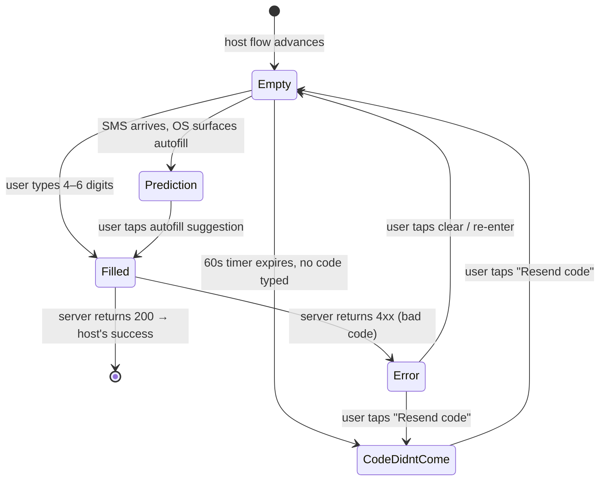
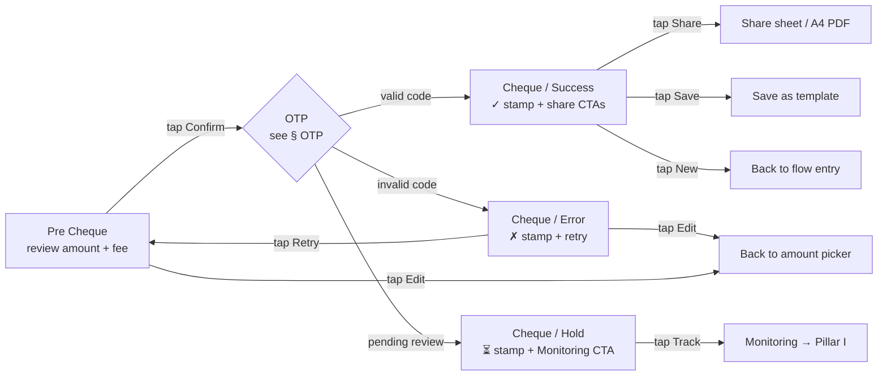
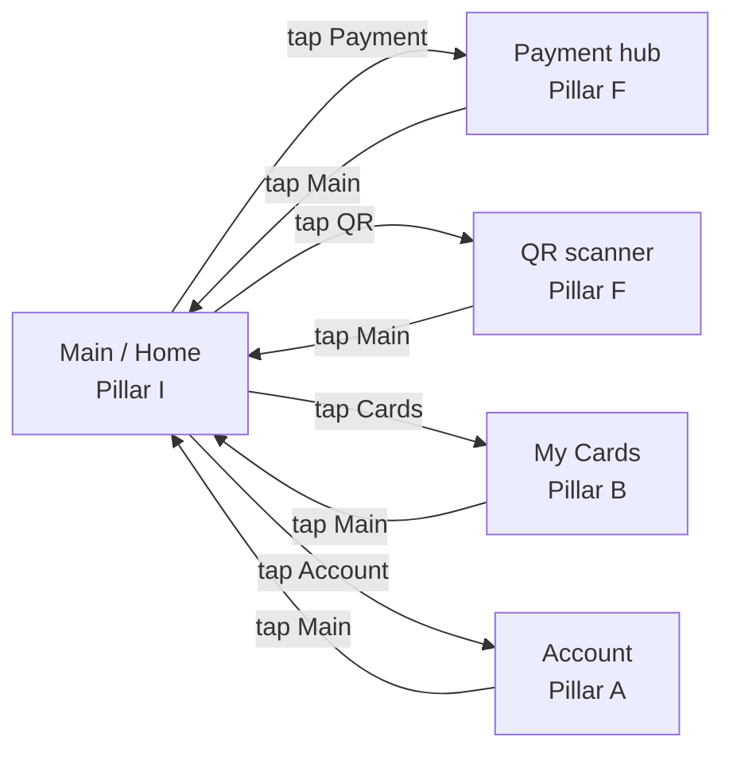
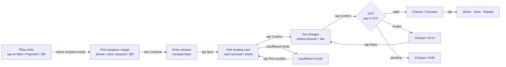

# 00 · Shared / cross-cutting flows

These templates appear inside almost every payment, transfer, and auth flow.
Pillar files reference this document instead of repeating the steps. Anchors
below match the cross-pillar callouts (e.g. `[#cheque](./00_Shared_flows.md#cheque)`).

Source: `Unired_FinalDesign_LightVersion_audit.md` cross-cutting observations,
`Unired_library_audit.md` System components.

**How to read this file.** Each template documents:
- The **state set** (named UI states + frame IDs)
- The **user-journey diagram** (states + the user actions / system events
  that move between them)
- The **step ledger** (what the user does, what they see, what's emitted to
  the host flow)
- **Entry & exit points** — which pillars open this template and which
  state hands control back

---

## OTP

The OTP screen ships as a **5-state set** that's embedded as a cross-reference
inside Auth, Payment, My Cards, Mahalliy o'tkazmalar, P2P, Visa exchange,
Steam, QR payment, ELQR, P2P RU↔UZ, and Bank account. The canonical master
lives inside `Light / Auth` at `9730:125982`.

**Entry points.** Any host flow that needs a server-issued one-time code:
- After `Phone Filled` on Auth (Pillar A)
- After `Pre Cheque` on every money-flow (Pillars D, E, F, G)
- Inside Set Email, Change Password, Card Add, Card Reissue, Set New PIN
  (Pillars A, B)

**Exit points.** Two outcomes only:
- **`Filled` accepted** → control returns to host with `success` (host then
  shows its cheque / success modal)
- **`Error` cleared** → re-enter OTP or fall back to `Code Didn't Come`
  (resend)

### State set

| State | Frame name | Screen content | Triggered by |
|---|---|---|---|
| Empty | Auth / OTP / Empty State | 4–6 empty digit slots, "Code sent to +998…" caption, hidden timer | Host flow advances after `Phone Filled` / `Pre Cheque` |
| Code didn't come | Auth / OTP / Code Didn't Come | "Resend code" CTA active (timer expired) | Resend timer reaches 0 with no code typed |
| Prediction | Auth / OTP / Code in Prediction | iOS / Android keyboard autofill suggestion attached above keypad | OS detects SMS code matching app's domain |
| Filled | Auth / OTP / Filled | All digits entered, submit enabled, validation pending | User finishes typing or taps autofill |
| Error | Auth / OTP / OTP Error | Red border on field, "Invalid or expired code" message, retry CTA | Server returns invalid-code response |

The Working-files **Authorization 1st Session** (`21534:127428`) extends this
with **Time Out** and **Loading** OTP states (see
[01_Identity_and_Access.md § WIP](./01_Identity_and_Access.md#wip--working-files)).

### User journey

### Step ledger

| # | User action | Screen state | Frame ID | What's emitted |
|---|---|---|---|---|
| 1 | (host hands over) | Empty | `9730:125982` | OTP request was sent server-side; SMS in-flight |
| 2 | Wait for SMS / type digits | Empty → Prediction (if autofill) → Filled | (master + variants) | 4–6 digit string |
| 3 | (auto on last digit) | Filled | (variant) | Submit OTP to server |
| 4a | (server: valid) | → host success | — | `code_verified=true` |
| 4b | (server: invalid) | Error | (variant) | Show retry CTA |
| 4c | (timer: 60s expired with no code) | Code Didn't Come | (variant) | Show resend CTA |
| 5 | Tap "Resend" | → Empty (timer resets) | — | New OTP request |

---

## Cheque

The cheque (transaction receipt) is the universal terminal screen for any
money-moving flow. Every payment / transfer section embeds 3–6 cheque
variants. The richest taxonomy lives in `P2P Russia ↔ Uzbekistan`
(`21328:122978`):

| Variant | Count in RU↔UZ | When shown | Screen content |
|---|---|---|---|
| Success | 3 | Server confirms transaction completed | Big ✓ stamp, amount + recipient, fee, timestamp, "Share / Save / New transfer" CTAs |
| Error | 3 | Server rejects (insufficient funds, blocked recipient, network) | ✗ stamp, error reason, "Try again" / "Contact support" CTAs |
| Hold | 6 | Transaction pending (compliance, manual review) | ⏳ stamp, "Under review" message, expected resolution time, "Track in Monitoring" CTA |

Other sections embed shorter cuts:

- **Mahalliy o'tkazmalar** — 3 cheque variants (`15065:97898`).
- **Payment** — 6 cheque variants (`13124:97996`).
- **Visa exchange** — 5 cheque variants (`13255:136716`).
- **My Cards / UCoin / Steam / QR / ELQR / Bank account / P2P** — each
  embeds its own cheque cut.

### Pre-cheque

Most flows insert a **Pre Cheque** confirmation screen *before* OTP, so the
user can verify the amount + recipient + fee before the bank prompt.
Examples: `P2P / UZ - KG / Pre Cheque`, `RU - UZ / By Card number / Pre
Cheque`, `My home / Inner / Services list / Payment / Payment cheque`.

**Pre Cheque content:**
- Amount (in source currency, with FX rate if cross-border)
- Recipient identifier (name / phone / account / card)
- Fee breakdown (Unired fee, partner-bank fee, total)
- "Confirm" CTA → triggers OTP
- "Edit" CTA → returns to amount / recipient picker

### A4 PDF export

Four standalone frames (size **595 × 842**) export the cheque as a printable
A4 receipt. Triggered from the success cheque's "Share / Save" action.

| ID | Name |
|---|---|
| `11421:47153` | Unired v1 |
| `11394:76902` | Unired v2 |
| `11527:50530` | Universalbank |
| `12829:95024` | Universalbank |
| `10249:76492` | A4 - Cheque for Payment by requisites (595×368) |

### Status stamp overlay

A 6-variant `Stamp` component (Components page, library audit) overlays the
cheque to signal status visually. Stamps are graphic, not interactive —
they reinforce the cheque's text status.

| Stamp | Used on |
|---|---|
| ✓ green | Cheque / Success |
| ✗ red | Cheque / Error |
| ⏳ amber | Cheque / Hold |
| (3 more variants — likely "Cancelled", "Refunded", "Test" per audit) | — |

### Canonical user journey

### Step ledger

| # | User action | Screen state | Frame ID (e.g. RU↔UZ) | What's emitted |
|---|---|---|---|---|
| 1 | (host hands over with amount + recipient) | Pre Cheque | `RU - UZ / By Card number / Pre Cheque` | Read-only summary |
| 2 | Tap "Confirm" | → OTP Empty | (cross-ref to OTP master) | OTP request fired |
| 3 | Complete OTP (see § OTP) | — | — | `code_verified=true/false` |
| 4a | (server: success) | Cheque / Success | `RU - UZ / Cheque / Success` (×3) | Transaction posted |
| 4b | (server: error) | Cheque / Error | `RU - UZ / Cheque / Error` (×3) | Transaction rejected |
| 4c | (server: pending) | Cheque / Hold | `RU - UZ / Cheque / Hold` (×6) | Transaction queued for review |
| 5a | Tap "Share" | A4 cheque sheet | `11421:47153` etc. | PDF / share sheet |
| 5b | Tap "New transfer" | → host flow entry | — | Reset host state |
| 5c | Tap "Track" (Hold only) | → Monitoring | (cross-pillar) | Open transaction detail |

---

## Bottom menu

Two bottom-menu component sets ship simultaneously — adoption is partial,
and a v3.3 reconciliation is required (see global plan §4.5).

| Component | Variants | Source |
|---|---|---|
| `Bottom menu` | 5 | Original — used on most Final-Design screens. |
| `Bottom Menu New` | 4 | Redesigned — adopted on a subset of screens. |
| `Bottom Menu Duotone` | 4 | Older icon set, deprecated. |

### Tabs (active-tab variant per destination)

| Tab | Pillar | Tap action |
|---|---|---|
| Main | I — Information | Returns to home dashboard |
| Payment | F — Pay services | Opens Payment hub |
| QR | F — Pay services | Opens QR scanner directly |
| Cards | B — Cards | Opens My Cards list |
| Account | A — Identity | Opens Account / Profile |

### When bottom menu is **not** rendered

- Splash / language picker (Pillar A entry)
- Auth / OTP / PIN / password screens (Pillar A active)
- Modals & bottom sheets (overlay UI)
- Cheque / receipt screens (terminal state)
- A4 PDF cheque exports (print artifact)
- Full-screen scanners (QR / ELQR camera-active states)

### User journey (cross-pillar tab navigation)

---

## Status icons & illustrations

| Asset set | Variants | Use |
|---|---|---|
| Status Icons | 17 | Inline status glyphs (success ✓, error ✗, pending, info, etc.) |
| Stamp | 6 | Cheque-overlay status seals (see § Cheque) |
| Service illustrations | 18 | Current illustration set on Payment categories |
| Service illustrations - old | 20 | Deprecated set still present in file |
| Splash screen illustrations | 4 | Splash + onboarding |
| Category Illustration | 30 | Payment / service category tiles |
| Different Backgrounds | 12 | Empty-state and hero backgrounds |

Empty / error / loading visuals are pulled from these sets — every pillar's
empty / error states reference one of them rather than inlining custom art.

---

## Loader & feedback

| Component | Variants | Use | Triggered by |
|---|---|---|---|
| Loader | 8 | OTP loading, payment loading, PIN check-mark loading, transfer-in-progress overlays | Async server round-trips ≥300 ms |
| Alert Info | 5 | Inline banners — info / success / warning / error / neutral | Non-blocking server messages |
| Modal - status | — | Big success / error / pending modals | Blocking server confirmations |

---

## Standard top-bar / chrome

Every screen except splash + cheque PDF exports ships with:

- `Status Bar` (2 variants — Light / Dark)
- `Top navbar` (2 variants — Default / With back)
- Optional `Section Heading` block (`Section heading description ×3`)

These are not flow-state-bearing — treat as chrome.

---

## Universal money-flow skeleton

Every payment + transfer flow in the app reuses the same skeleton, with the
specifics swapped per pillar:

### Flow-skeleton step ledger

| # | User action | Screen | Result |
|---|---|---|---|
| 1 | Tap pillar entry on Main | Recipient picker (per pillar — phone / card / requisites / scan) | Recipient identified |
| 2 | Tap "Continue" / select recipient | Amount-entry screen with numpad | Amount in flow state |
| 3 | Tap "Next" | Funding-card picker (cards carousel) | Card selected |
| 4 | Tap "Confirm" | Pre Cheque (review) | Read-only summary shown |
| 5 | Tap "Confirm" | OTP Empty | OTP request fired |
| 6 | Type / autofill 4–6 digits | OTP Filled | Submit triggered |
| 7 | (server: ok) | Cheque / Success | Transaction posted |
| 7' | (server: error) | Cheque / Error | Retry CTA |
| 7'' | (server: hold) | Cheque / Hold | Track-in-Monitoring CTA |
| 8 | Tap Share / Save / New | A4 cheque / Templates list / Flow restart | Flow ends |

Each pillar's flows are concrete instantiations of this skeleton. Knowing
this lets a reader skim a pillar file and only focus on the pillar-specific
divergence (recipient picker UX, fee display, country flag, etc.).
