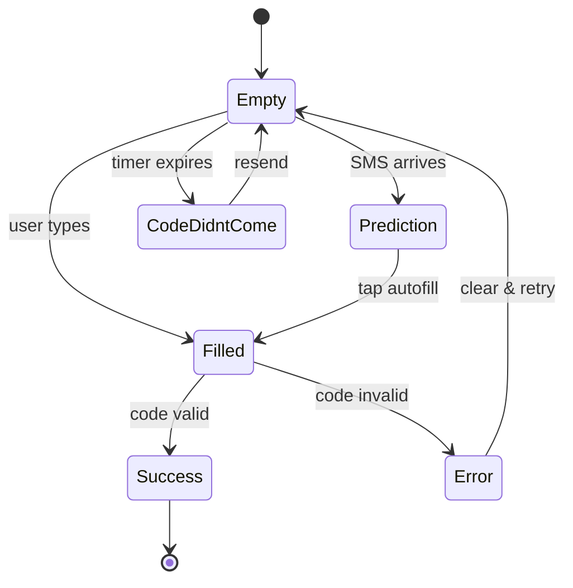
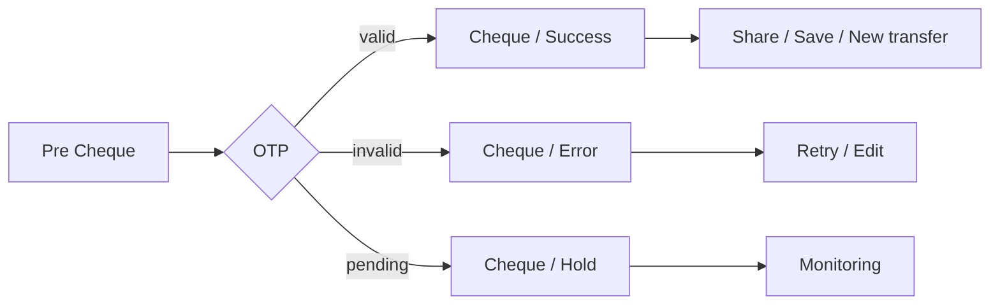
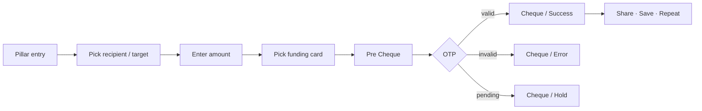

# 00 · Shared / cross-cutting flows

These templates appear inside almost every payment, transfer, and auth flow.
Pillar files reference this document instead of repeating the steps. Anchors
below match the cross-pillar callouts (e.g. `[#cheque](./00_Shared_flows.md#cheque)`).

Source: `Unired_FinalDesign_LightVersion_audit.md` cross-cutting observations,
`Unired_library_audit.md` System components.

---

## OTP

The OTP screen ships as a **5-state set** that's embedded as a cross-reference
inside Auth, Payment, My Cards, Mahalliy o'tkazmalar, P2P, Visa exchange,
Steam, QR payment, ELQR, P2P RU↔UZ, and Bank account. The canonical master
lives inside `Light / Auth` at `9730:125982`.

### State set

| State | Frame name | Notes |
|---|---|---|
| Empty | Auth / OTP / Empty State | Resting field, code not yet entered. |
| Code didn't come | Auth / OTP / Code Didn't Come | "Resend code" CTA active. |
| Prediction | Auth / OTP / Code in Prediction | iOS / Android autofill suggestion attached. |
| Filled | Auth / OTP / Filled | All digits entered, submit enabled. |
| Error | Auth / OTP / OTP Error | Invalid / expired code. |

The Working-files **Authorization 1st Session** (`21534:127428`) extends this
with **Time Out** and **Loading** OTP states (see
[01_Identity_and_Access.md § WIP](./01_Identity_and_Access.md#wip--working-files)).

### Flow shape

Where `Success` resolves into the host flow (auth → set PIN, payment →
cheque, transfer → cheque, etc.).

---

## Cheque

The cheque (transaction receipt) is the universal terminal screen for any
money-moving flow. Every payment / transfer section embeds 3–6 cheque
variants. The richest taxonomy lives in `P2P Russia ↔ Uzbekistan`
(`21328:122978`):

| Variant | Count in RU↔UZ | Meaning |
|---|---|---|
| Success | 3 | Transaction completed; share / save / new transfer CTAs. |
| Error | 3 | Failed transaction; reason + retry. |
| Hold | 6 | Pending / under review (largest sub-set). |

Other sections embed shorter cuts:

- **Mahalliy o'tkazmalar** — 3 cheque variants (`15065:97898`).
- **Payment** — 6 cheque variants (`13124:97996`).
- **Visa exchange** — 5 cheque variants (`13255:136716`).
- **My Cards / UCoin / Steam / QR / ELQR / Bank account / P2P** — each
  embeds its own cheque cut.

### Pre-cheque

Most flows insert a **Pre Cheque** confirmation screen before OTP, so the
user can verify the amount + recipient + fee before the bank prompt.
Examples: `P2P / UZ - KG / Pre Cheque`, `RU - UZ / By Card number / Pre
Cheque`, `My home / Inner / Services list / Payment / Payment cheque`.

### A4 PDF export

Four standalone frames (size **595 × 842**) export the cheque as a printable
A4 receipt:

| ID | Name |
|---|---|
| `11421:47153` | Unired v1 |
| `11394:76902` | Unired v2 |
| `11527:50530` | Universalbank |
| `12829:95024` | Universalbank |
| `10249:76492` | A4 - Cheque for Payment by requisites (595×368) |

### Status stamp overlay

A 6-variant `Stamp` component (Components page, library audit) overlays the
cheque to signal status visually (success ✓, error ✗, hold, etc.).

### Canonical flow shape

---

## Bottom menu

Two bottom-menu component sets ship simultaneously — adoption is partial,
and a v3.3 reconciliation is required (see global plan §4.5).

| Component | Variants | Source |
|---|---|---|
| `Bottom menu` | 5 | Original — used on most Final-Design screens. |
| `Bottom Menu New` | 4 | Redesigned — adopted on a subset of screens. |
| `Bottom Menu Duotone` | 4 | Older icon set, deprecated. |

Active-tab variants: 5 destinations across the original set
(Main / Payment / QR / Cards / Account, exact mapping via the `Main` and
`Payment` sections). Bottom menu is **not** rendered on:
- Splash / language picker
- Auth / OTP / PIN / password screens
- Modals & bottom sheets
- Cheque / receipt screens
- A4 PDF cheque exports

---

## Status icons & illustrations

| Asset set | Variants | Use |
|---|---|---|
| Status Icons | 17 | Inline status glyphs (success ✓, error ✗, pending, info, etc.) |
| Stamp | 6 | Cheque-overlay status seals |
| Service illustrations | 18 | Current illustration set on Payment categories |
| Service illustrations - old | 20 | Deprecated set still present in file |
| Splash screen illustrations | 4 | Splash + onboarding |
| Category Illustration | 30 | Payment / service category tiles |
| Different Backgrounds | 12 | Empty-state and hero backgrounds |

Empty / error / loading visuals are pulled from these sets — every pillar's
empty / error states reference one of them rather than inlining custom art.

---

## Loader & feedback

| Component | Variants | Use |
|---|---|---|
| Loader | 8 | Multiple animation presets — used for OTP loading, payment
  loading, PIN check-mark loading, transfer-in-progress overlays. |
| Alert Info | 5 | Info / success / warning / error / neutral inline alerts. |
| Modal - status | — | Status-modal pattern (success / error / pending big modals). |

---

## Standard top-bar / chrome

Every screen except splash + cheque PDF exports ships with:

- `Status Bar` (2 variants — Light / Dark)
- `Top navbar` (2 variants — Default / With back)
- Optional `Section Heading` block (`Section heading description ×3`).

These are not flow-state-bearing — treat as chrome.

---

## Universal money-flow skeleton

Every payment + transfer flow in the app reuses the same skeleton, with the
specifics swapped per pillar:

Each pillar's flows are concrete instantiations of this skeleton. Knowing
this lets a reader skim a pillar file and only focus on the pillar-specific
divergence (recipient picker UX, fee display, country flag, etc.).
