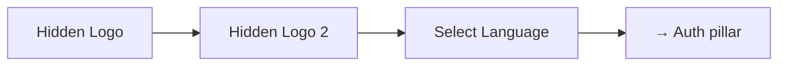
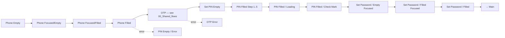
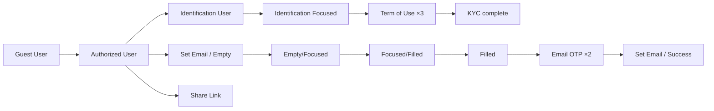
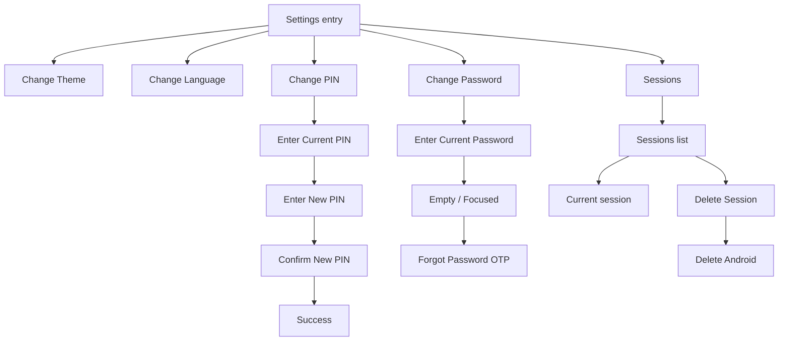
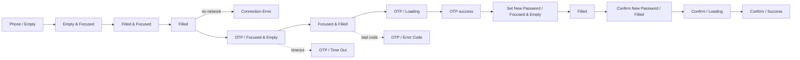

# 01 · Identity & Access · Pillar A

Sign-in, KYC, profile, security. The universal entry point — every other
pillar starts here.

| Section | Page | Node ID | Frames | Status |
|---|---|---|---|---|
| Light / Splash Screens | Final Design | `9730:125894` | 3 | Final |
| Light / Auth | Final Design | `9730:125922` | 38 | Final |
| Light / Account | Final Design | `10358:83682` | 27 | Final |
| Light / Settings | Final Design | `11400:77528` | 26 | Final |
| Authorization 1st Session | Working files | `21534:127428` | 20 | **WIP — promote-ready** |
| Light / Support Screen | Working files | standalone | 1 | WIP |
| Light / Auth / Help | Working files | standalone | 1 | WIP |
| Light / Auth / Phone Number / Empty State | Working files | standalone | 11 | Iteration scratch |

**Total: 94 Final + ~33 WIP frames.**

---

## A.1 · Splash + language

| # | Frame | ID |
|---|---|---|
| 1 | Light / Splash Screens / Logo / Hidden Logo | `9730:125895` |
| 2 | Light / Splash Screens / Logo / Hidden Logo (variant) | `9730:125902` |
| 3 | Light / Splash Screens / Select Language | `9730:125909` |

A standalone splash variant exists at `13581:65001`.

---

## A.2 · Phone-number sign-in → OTP → set PIN → set password

The canonical first-time auth flow.

### Phone field — 4 states (`9730:125923` master)

| State | Frame |
|---|---|
| Empty | Light / Auth / Phone Number / Empty State |
| Focused / Empty | Light / Auth / Phone Number / Focused/Empty |
| Focused / Filled | Light / Auth / Phone Number / Focused/Filled |
| Filled | Light / Auth / Phone Number / Filled |

### OTP — 5 states (`9730:125982` master)

See [00_Shared_flows § OTP](./00_Shared_flows.md#otp).

### Set PIN / Enter PIN — 10 states (`9730:126068` master)

| State | Frame |
|---|---|
| Set PIN / Empty | Light / Auth / Set PIN / Empty |
| PIN / Empty | Light / Auth / PIN / Empty |
| PIN / Empty / Error | Light / Auth / PIN / Empty / Error |
| PIN / Filled Step 1 | Light / Auth / PIN / Filled Step 1 |
| PIN / Filled Step 2 | Light / Auth / PIN / Filled Step 2 |
| PIN / Filled Step 3 | Light / Auth / PIN / Filled Step 3 |
| PIN / Filled Step 4 | Light / Auth / PIN / Filled Step 4 |
| PIN / Filled Step 5 | Light / Auth / PIN / Filled Step 5 |
| PIN / Filled / Loading | Light / Auth / PIN / Filled / Loading |
| PIN / Filled / Check Mark | Light / Auth / PIN / Filled / Check Mark |

The 7-frame **Confirm Code Animation** sub-set (Animation Step 1/2/3 + Loading
+ Check mark + Confirmation + Error in Confirmation) layers on top of the
PIN states for the post-entry feedback animation.

### Set / Enter Password — 8 states (`9730:126284` master)

| State | Frame |
|---|---|
| Set / Empty Focused | Light / Auth / Set Password / Empty Focused |
| Enter / Empty Focused | Light / Auth / Enter Password / Empty Focused (×2) |
| Enter / Empty Placeholder | Light / Auth / Enter Password / Empty Placeholder |
| Set / Filled Focused | Light / Auth / Set Password / Filled Focused |
| Set / Filled (3 variants) | Light / Auth / Set Password / Filled |
| Set / Filled / Password Showed | Light / Auth / Set Password / Filled / Password Showed |

*Reuses OTP template — see [00_Shared_flows § OTP](./00_Shared_flows.md#otp).*

---

## A.3 · Account / KYC / identification

Source: `Light / Account` (`10358:83682`).

### Sub-flows

- **Guest:** Guest User · Guest / Dark Theme Icon.
- **Authorized:** Authorized User entry.
- **Identification (KYC):** 4 base + 6 focused + 3 Terms of Use frames.
- **Set Email:** Empty → Focused → Filled → OTP (×2) → Success.
- **Share Link:** Single screen.
- 2 oversized frames (617×972) — modal compositions / preview canvases.

*Reuses OTP template — see [00_Shared_flows § OTP](./00_Shared_flows.md#otp).*

---

## A.4 · Settings — theme · language · PIN · password · sessions

Source: `Light / Settings` (`11400:77528`).

| Cluster | Frames |
|---|---|
| Settings entry | `11400:77529` |
| Change Theme | `11442:84239` |
| Change Language | `11563:81643` |
| Change PIN | Enter Current · Enter New · Confirm New · Success message |
| Change Password | Empty · Current password (×2) · Focused · Forgot Password OTP |
| Sessions | Sessions list · Current session · Delete Session · Delete (Android) |

8 frames named `Light / Auth / Set Password / Filled Focused State` are
**pinned cross-references** inside this section (not real Settings flow).

*Reuses OTP template — see [00_Shared_flows § OTP](./00_Shared_flows.md#otp).*

---

## A.5 · Theme switch (current state)

| State | Coverage |
|---|---|
| Light theme | Full app coverage. |
| Dark theme | **One frame only** — `Dark / Gamification` (`20917:117600`, see [09_Information_Engagement.md](./09_Information_Engagement.md#i6--gamification-wip)). |

The `Color palette` variable collection has Light + Dark modes (28 vars), but
`Main variables collection` is Light-only (24 vars). Anything bound to the
latter won't flip on theme change. See global plan §4.4.

---

## WIP / Working files

### Authorization 1st Session — `21534:127428` · 20 frames · UNIQUE

A separate auth proposal targeting the **first-session-only** path. Adds
error / timeout / loading states the canonical Auth omits. Naming uses
`Auth /` (not `Light / Auth /`) — different convention.

| Frame |
|---|
| Auth / Phone Number / Empty |
| Auth / Phone Number / Empty & Focused |
| Auth / **Connection Error** |
| Auth / Phone Number / Filled & Focused |
| Auth / Phone Number / Filled |
| Auth / OTP Code / Focused & Empty |
| Auth / OTP Code / **Time Out** |
| Auth / OTP Code / Focused & Filled |
| Auth / OTP Code / Error Code (×2) |
| Auth / OTP Code / **Loading** |
| Auth / Set New Password / Focused & Empty (×3) |
| Auth / Set New Password / Focused & Filled |
| Auth / Confirm New Password / Focused & Filled (×2) |
| Auth / Confirm New Password / **Loading** |
| Auth / Confirm New Password / **Success** |
| Annotations |

**Diff vs canonical Auth:** Connection Error · OTP Time Out · OTP Loading ·
Confirm Password Loading + Success. Promote candidate — port the missing
states onto the 38-frame canonical skeleton (global plan §5 Step 1).

### Phone-number iteration scratch — 11 standalones

11 loose `Light / Auth / Phone Number / Empty State` variants on Working
files. Iterative exploration of the canonical phone-number entry treatment.
Treat as scratch unless picking the canonical version is the open task.

### Help & Support scratch

- `Light / Auth / Help` (1 standalone) — Help-from-auth screen, not in Final.
- `Light / Support Screen` (1 standalone) + Working-files Support section
  → covered in [09_Information_Engagement.md § WIP](./09_Information_Engagement.md#wip--working-files).

---

## Open questions (from global plan §4)

1. **Auth canonical** — keep Final Design's `Light / Auth` (38) or promote
   *Authorization 1st Session* (20, richer errors)? Recommendation: promote,
   then port missing states onto the existing 38-frame skeleton.
2. **Dark mode policy** — only Gamification has Dark. Decide: full Dark
   theme or remove the lone Dark frame.

---

## Reusable components

From `Unired_library_audit.md`:

- **Input** (35 variants — overspecced)
- **PIN Code** (2)
- **Indicator** (4 — likely PIN dot)
- **Loader** (8) — for OTP / PIN / password loading
- **Switch** (4) — Settings toggles
- **Status Bar** (2)
- **Top navbar** (2)
- **Theme Icons** (2)
- **Modal - status** — for Set-Email-Success and Confirm-Password-Success
- **Alert Info** (5 states) — for Connection Error / Time Out
- **Splash screen illustrations** (4)
