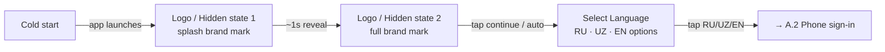

# 01 · Identity & Access · Pillar A

Sign-in, KYC, profile, security. The universal entry point — every other
pillar starts here.

| Section | Page | Node ID | Frames | Status |
|---|---|---|---|---|
| Light / Splash Screens | Final Design | `9730:125894` | 3 | Final |
| Light / Auth | Final Design | `9730:125922` | 38 | Final |
| Light / Account | Final Design | `10358:83682` | 27 | Final |
| Light / Settings | Final Design | `11400:77528` | 26 | Final |
| Authorization 1st Session | Working files | `21534:127428` | 20 | **WIP — promote-ready** |
| Light / Support Screen | Working files | standalone | 1 | WIP |
| Light / Auth / Help | Working files | standalone | 1 | WIP |
| Light / Auth / Phone Number / Empty State | Working files | standalone | 11 | Iteration scratch |

**Total: 94 Final + ~33 WIP frames.**

---

## A.1 · Splash + language

**Entry:** App cold-start.
**Exit:** → A.2 (sign-in).
**Goal:** identify locale before any text-bearing screen.



| # | User action | Screen | Frame | Frame ID | Result |
|---|---|---|---|---|---|
| 1 | (app cold-launch) | Logo / Hidden | Light / Splash Screens / Logo / Hidden Logo | `9730:125895` | App initialises, brand mark fades in |
| 2 | Wait ~1 s | Logo (full) | Light / Splash Screens / Logo / Hidden Logo (variant) | `9730:125902` | Brand fully visible |
| 3 | Tap "Continue" / auto-advance | Select Language | Light / Splash Screens / Select Language | `9730:125909` | Language picker shown |
| 4 | Tap RU / UZ / EN | (transition) | — | — | Locale stored, → A.2 |

Standalone splash variant at `13581:65001` — alternate brand treatment, same step.

---

## A.2 · Phone-number sign-in → OTP → set PIN → set password

The canonical first-time auth flow. **5 sub-flows chained:** phone entry,
OTP, PIN setup, post-PIN animation, password setup.

**Entry:** From A.1 (Select Language).
**Exit:** → I.1 (Main / authorized).
**Goal:** capture phone, verify ownership via SMS, lock with PIN, set
recovery password.

### High-level user journey

```mermaid
flowchart LR
    Lang[A.1 Lang] --> P0[Phone Empty]
    P0 -->|tap field| P1[Phone Focused / Empty<br/>numpad up]
    P1 -->|type 9 digits| P2[Phone Focused / Filled]
    P2 -->|tap Send code| P3[Phone Filled<br/>submitting]
    P3 -->|server: ok| O0[OTP Empty<br/>see § OTP]
    P3 -.server: rate-limit.-> P0
    O0 -->|valid| PIN0[Set PIN Empty]
    O0 -.invalid.-> OErr[OTP Error]
    OErr -->|tap clear| O0
    PIN0 -->|tap digits 1..5| PIN1[PIN Filled Step 1..5]
    PIN1 -->|complete| PINL[PIN Filled / Loading]
    PINL --> PINC[PIN Filled / Check Mark]
    PINC -->|tap continue| PW0[Set Password / Empty Focused]
    PW0 -->|type password| PW1[Set Password / Filled Focused]
    PW1 -->|tap show| PW2[Filled / Password Showed]
    PW2 -->|tap Save| Main[→ I.1 Main / Authorized]
```



### Sub-flow A.2.a — Phone entry (4-state field)

The phone field has 4 explicit states. Frame master: `9730:125923`.

| State | User action | Screen | Frame | What's emitted |
|---|---|---|---|---|
| Empty | (arrive from A.1) | Resting field, country flag chip, "+998" prefix, placeholder text | Light / Auth / Phone Number / Empty State | — |
| Focused / Empty | Tap field | Numpad slides up, cursor in field | Light / Auth / Phone Number / Focused/Empty | Keyboard active |
| Focused / Filled | Type 9 digits | Field shows formatted phone, "Send code" CTA enabled | Light / Auth / Phone Number / Focused/Filled | Phone string ready |
| Filled | Tap "Send code" | Loading state, CTA disabled | Light / Auth / Phone Number / Filled | OTP request fired → A.2.b |

**Recovery:** if user taps outside the field, returns to Focused / Empty
or Empty depending on input.

### Sub-flow A.2.b — OTP

5-state OTP — see [00_Shared_flows § OTP](./00_Shared_flows.md#otp). Frame
master: `9730:125982`.

| State | User action | Screen | Frame |
|---|---|---|---|
| Empty | (arrive from A.2.a) | 4–6 empty digit slots, timer counting down | Light / Auth / OTP / Empty State |
| Code in Prediction | (OS surfaces autofill) | Autofill chip above keyboard | Light / Auth / OTP / Code in Prediction |
| Filled | Type all digits / tap autofill | Submit triggered automatically | Light / Auth / OTP / Filled |
| OTP Error | (server: invalid code) | Red border, "Invalid code" message, retry CTA | Light / Auth / OTP / OTP Error |
| Code Didn't Come | (timer hits 0 with no code) | "Resend code" CTA active | Light / Auth / OTP / Code Didn't Come |

**Recovery from OTP Error:** tap clear → back to Empty (timer continues).
**Recovery from Code Didn't Come:** tap "Resend code" → fires new OTP
request, timer resets.

### Sub-flow A.2.c — Set PIN (10-state)

Frame master: `9730:126068`. The PIN UI is a 4-digit pinpad with explicit
per-step states.

| Step | User action | Screen | Frame |
|---|---|---|---|
| 1 | (arrive from A.2.b) | 4 empty pin dots, numeric pinpad below | Light / Auth / Set PIN / Empty |
| 2 | Tap digit 1 | First dot fills | Light / Auth / PIN / Filled Step 1 |
| 3 | Tap digit 2 | Second dot fills | Light / Auth / PIN / Filled Step 2 |
| 4 | Tap digit 3 | Third dot fills | Light / Auth / PIN / Filled Step 3 |
| 5 | Tap digit 4 | Fourth dot fills | Light / Auth / PIN / Filled Step 4 |
| 6 | Tap digit 5 (confirm) | Fifth dot fills (re-enter) | Light / Auth / PIN / Filled Step 5 |
| 7 | (auto on completion) | Spinner overlay on pin row | Light / Auth / PIN / Filled / Loading |
| 8 | (server: ok) | Green check-mark animation | Light / Auth / PIN / Filled / Check Mark |
| Err1 | (PIN mismatch) | Red shake animation | Light / Auth / PIN / Empty / Error |

The 7-frame **Confirm Code Animation** sub-set (Animation Step 1/2/3 +
Loading + Check mark + Confirmation + Error in Confirmation) layers on top
of these states for the post-entry feedback animation.

**Recovery from PIN error:** auto-clear field, back to Set PIN / Empty,
counter increments. After N retries the flow may lock — that case is
covered better by the WIP **Authorization 1st Session** (see § WIP).

### Sub-flow A.2.d — Set / Enter Password (8-state)

Frame master: `9730:126284`. After PIN, user creates a recovery password.

| State | User action | Screen | Frame |
|---|---|---|---|
| Empty Focused | (arrive from A.2.c) | Password field focused, masked dots, keyboard up | Light / Auth / Set Password / Empty Focused |
| Empty Placeholder | (re-entry from elsewhere) | Field with grey placeholder | Light / Auth / Enter Password / Empty Placeholder |
| Filled Focused | Type password | Masked dots fill, "Save" CTA enabled | Light / Auth / Set Password / Filled Focused |
| Filled (3 variants) | (lose focus) | Masked dots, save CTA still active | Light / Auth / Set Password / Filled |
| Filled / Password Showed | Tap eye icon | Plaintext password visible | Light / Auth / Set Password / Filled / Password Showed |
| (re-enter for confirm) | (system shows confirm screen) | Same shape, "Confirm password" header | Light / Auth / Enter Password / Empty Focused (×2) |

**Exit:** tap "Save" on confirm screen → user is authenticated → I.1 Main.

*Reuses OTP template — see [00_Shared_flows § OTP](./00_Shared_flows.md#otp).*

---

## A.3 · Account / KYC / identification

**Entry:** Tap "Account" tab on bottom menu, OR Main → "Verify identity"
banner, OR Settings → identification CTA.
**Exit:** Returns to Main / Settings, or KYC complete unlocks higher-limit
features.

Three independent sub-flows under one section: **identification (KYC)**,
**email setup**, **share-link** (referral / contact share).

```mermaid
flowchart LR
    Acct[Account entry] -->|signed-out| G[Guest User screen]
    Acct -->|signed-in| A[Authorized User screen]
    G -->|tap "Sign in"| AuthPillar[→ A.2]
    A -->|tap "Verify identity"| ID0[Identification User]
    ID0 -->|tap fields, type| ID1[Identification Focused ×6]
    ID1 -->|tap "Read terms"| ToU[Term of Use ×3]
    ToU -->|tap "Agree"| KYCdone[KYC submitted]
    A -->|tap "Set email"| Email0[Set Email / Empty]
    Email0 -->|tap field| Email1[Empty / Focused]
    Email1 -->|type| Email2[Focused / Filled]
    Email2 -->|tap Send code| EmailOTP[Email OTP ×2]
    EmailOTP -->|valid| EmailOK[Set Email / Success]
    A -->|tap "Share profile"| Share[Share Link sheet]
```

### Sub-flow A.3.a — Identification (KYC)

Source: `Light / Account` (`10358:83682`). 4 base + 6 focused + 3 ToU = 13
frames.

| # | User action | Screen | Frame |
|---|---|---|---|
| 1 | Tap "Verify identity" on Account | Identification entry | Light / Account / Identification User |
| 2 | Tap field 1 (passport / ID number) | Focused field 1 | Light / Account / Identification User / Focused |
| 3 | Tap field 2 (date of birth) | Focused field 2 | Light / Account / Identification User / Focused (variant) |
| 4–7 | Tap remaining KYC fields | Focused variants 3–6 | Light / Account / Identification User / Focused |
| 8 | Tap "Read terms" | Terms of Use modal | Light / Account / Term of Use |
| 9 | Scroll terms | Term of Use scroll state | Light / Account / Term of Use (variant) |
| 10 | Tap "Agree" | Term of Use confirm | Light / Account / Term of Use (variant) |
| 11 | Tap "Submit" | Submission loading | (cross-ref Loader) |
| 12 | (server: queued for review) | Returns to Account with "KYC pending" badge | — |

### Sub-flow A.3.b — Set email + OTP

| # | User action | Screen | Frame | Result |
|---|---|---|---|---|
| 1 | Tap "Set email" | Empty | Light / Account / Set Email / Empty | Field shown |
| 2 | Tap field | Focused / Empty | Light / Account / Set Email / Empty / Focused | Keyboard up |
| 3 | Type email | Focused / Filled | Light / Account / Set Email / Focused / Filled | Validation in progress |
| 4 | (after blur) | Filled | Light / Account / Set Email / Filled | "Send code" enabled |
| 5 | Tap "Send code" | Email OTP screen 1 | Light / Account / Set Email / OTP | OTP sent to email |
| 6 | Type code | Email OTP screen 2 | Light / Account / Set Email / OTP (variant) | Submit |
| 7 | (server: ok) | Success | Light / Account / Set Email / Success | Email saved |

*Reuses OTP template — see [00_Shared_flows § OTP](./00_Shared_flows.md#otp).*

### Sub-flow A.3.c — Share link

Single screen: `Light / Account / Share Link`. Tap → invokes OS share
sheet with personalised invite URL.

### Modal / oversized canvases

Two `617×972` frames inside this section — likely modal compositions or
oversized preview canvases. Not flow-bearing on a phone viewport.

---

## A.4 · Settings — theme · language · PIN · password · sessions

**Entry:** Account → "Settings" CTA, OR Main → settings gear icon.
**Exit:** Save (each sub-flow) returns to Settings root.

Five independent sub-flows. Source: `Light / Settings` (`11400:77528`).

```mermaid
flowchart TB
    S[Settings root] -->|tap "Theme"| T[Change Theme<br/>Light / Dark toggle]
    S -->|tap "Language"| L[Change Language<br/>RU / UZ / EN]
    S -->|tap "Change PIN"| CP1[Enter Current PIN]
    CP1 -->|valid current| CP2[Enter New PIN]
    CP1 -.invalid.-> CP1
    CP2 -->|enter new| CP3[Confirm New PIN]
    CP3 -->|matches| CPS[Success]
    S -->|tap "Change Password"| CW1[Empty]
    CW1 -->|tap field| CW2[Current password Focused ×2]
    CW2 -.tap "Forgot password".-> CW3[Forgot Password OTP]
    CW3 -->|valid| Reset[Reset password flow]
    S -->|tap "Sessions"| SS1[Sessions list]
    SS1 -->|tap a session| SS2[Current session detail]
    SS1 -->|swipe / tap delete| SS3[Delete confirmation]
    SS3 -->|confirm| SS4[Delete (Android variant)]
```

### Sub-flow A.4.a — Change theme

| # | User action | Screen | Frame |
|---|---|---|---|
| 1 | Tap "Theme" | Theme picker | `11442:84239` |
| 2 | Tap Light / Dark | Theme applied immediately | (transition) |
| 3 | Tap back | → Settings root | — |

**Note:** Dark mode is **one-frame-deep** in the rest of the file (only
Gamification has Dark). See [§ A.5](#a5--theme-switch-current-state) and
global plan §4.4.

### Sub-flow A.4.b — Change language

Single screen at `11563:81643`. Same pattern as A.4.a — tap RU / UZ / EN,
locale flips, return.

### Sub-flow A.4.c — Change PIN (4 steps)

| # | User action | Screen | Frame |
|---|---|---|---|
| 1 | Tap "Change PIN" | Enter Current | Light / Settings / Change PIN / Enter Current |
| 2 | Type current 4 digits | (validates) | (loader) |
| 2a | (invalid) | Re-shows Enter Current with error | (variant) |
| 3 | Type new 4 digits | Enter New | Light / Settings / Change PIN / Enter New |
| 4 | Re-type new 4 digits | Confirm New | Light / Settings / Change PIN / Confirm New |
| 5 | (matches) | Success message modal | Light / Settings / Change PIN / Success message |
| 6 | Tap "OK" | → Settings root | — |

### Sub-flow A.4.d — Change password (with forgot-password fallback)

| # | User action | Screen | Frame |
|---|---|---|---|
| 1 | Tap "Change Password" | Empty | Light / Settings / Change Password / Empty |
| 2 | Tap field | Current password ×2 | Light / Settings / Change Password / Current |
| 3 | Tap "Forgot password?" | Forgot Password OTP | Light / Settings / Change Password / Forgot Password OTP |
| 4 | (rest of forgot flow falls into A.2.b OTP) | — | — |

8 frames named `Light / Auth / Set Password / Filled Focused State` are
**pinned cross-references** inside this section (not real Settings flow —
ignore for flow purposes).

### Sub-flow A.4.e — Sessions list

| # | User action | Screen | Frame |
|---|---|---|---|
| 1 | Tap "Sessions" | List | Light / Settings / Sessions list |
| 2 | Tap a session | Current session detail | Light / Settings / Current session |
| 3 | Swipe / tap "Delete" | Delete confirmation | Light / Settings / Delete Session |
| 4 | (Android variant) | Native delete sheet | Light / Settings / Delete (Android) |

*Reuses OTP template (Forgot password) — see [00_Shared_flows § OTP](./00_Shared_flows.md#otp).*

---

## A.5 · Theme switch (current state)

| Theme | Coverage |
|---|---|
| Light | Full app coverage — every flow in this file is Light. |
| Dark | **One frame only** — `Dark / Gamification` (`20917:117600`, see [09_Information_Engagement.md](./09_Information_Engagement.md#i6--gamification-wip)). |

The `Color palette` variable collection has Light + Dark modes (28 vars), but
`Main variables collection` is Light-only (24 vars). Anything bound to the
latter won't flip on theme change. See global plan §4.4.

---

## WIP / Working files

### Authorization 1st Session — `21534:127428` · 20 frames · UNIQUE

A separate auth proposal targeting the **first-session-only** path. Adds
error / timeout / loading states the canonical Auth omits. Naming uses
`Auth /` (not `Light / Auth /`) — different convention.

**Entry:** Same as A.2 (cold-start after language).
**Exit:** Same as A.2 (→ I.1 Main).
**Goal:** richer error coverage than canonical Auth — explicitly handles
network failures, OTP timeouts, and async loading.

```mermaid
flowchart LR
    Lang[Language picked] --> P0[Phone / Empty]
    P0 -->|tap field| P1[Empty & Focused]
    P1 -->|type 9 digits| P2[Filled & Focused]
    P2 -->|tap Send code| P3[Filled<br/>submitting]
    P3 -.network down.-> ConnErr[Connection Error<br/>retry CTA]
    ConnErr -->|tap Retry| P3
    P3 -->|server ok| O0[OTP / Focused & Empty]
    O0 -->|type| O1[Focused & Filled]
    O1 -->|auto submit| OL[OTP / Loading<br/>spinner]
    OL -->|valid| SP[Set New Password / Focused & Empty]
    O0 -.timer 0.-> OT[OTP / Time Out<br/>resend CTA]
    OT -->|tap Resend| O0
    O1 -.bad code.-> OE[OTP / Error Code]
    OE -->|tap clear| O0
    SP -->|type| SP1[Set Password / Filled]
    SP1 -->|tap Continue| CP[Confirm New Password / Filled]
    CP -->|tap Save| CPL[Confirm / Loading]
    CPL -->|server ok| CPS[Confirm / Success]
    CPS -->|tap Continue| Main[→ I.1 Main]
```



### Step ledger — diff vs canonical Auth

| # | Step | Canonical Auth (Final) | Authorization 1st Session (WIP) |
|---|---|---|---|
| 1 | Phone empty / focused / filled | ✅ 4 states | ✅ 4 states |
| 2 | **Connection error on submit** | ❌ not covered | ✅ Auth / Connection Error |
| 3 | OTP empty / filled | ✅ Empty + Filled | ✅ Focused & Empty + Focused & Filled |
| 4 | **OTP loading** | ❌ relies on PIN's animation | ✅ Auth / OTP Code / Loading |
| 5 | **OTP timeout** | ❌ uses Code Didn't Come | ✅ Auth / OTP Code / Time Out (explicit) |
| 6 | OTP error | ✅ OTP Error | ✅ OTP Code / Error Code (×2 variants) |
| 7 | Set new password | ✅ 8 states | ✅ 4 states (slimmer) |
| 8 | Confirm password | ✅ part of Set | ✅ separate Confirm screens |
| 9 | **Confirm loading** | ❌ not covered | ✅ Confirm / Loading |
| 10 | **Confirm success** | (modal-status) | ✅ Confirm / Success (explicit screen) |

**Notable additions** (the "promote-ready" reason):
- `Auth / Connection Error` — the only network-failure screen in the file
- `Auth / OTP Code / Time Out` — explicit timeout vs canonical's "code
  didn't come"
- `Auth / OTP Code / Loading` — explicit async state during code
  validation
- `Auth / Confirm New Password / Loading` + `Success` — explicit async +
  terminal screens

### Phone-number iteration scratch — 11 standalones

11 loose `Light / Auth / Phone Number / Empty State` variants on Working
files. Iterative exploration of the canonical phone-number entry treatment
(margin, keyboard treatment, country chip placement). Treat as scratch
unless picking the canonical version is the open task.

### Help & Support scratch

- `Light / Auth / Help` (1 standalone) — Help-from-auth screen, not in Final.
- `Light / Support Screen` (1 standalone) + Working-files Support section
  → covered in [09_Information_Engagement.md § WIP](./09_Information_Engagement.md#wip--working-files).

---

## Open questions (from global plan §4)

1. **Auth canonical** — keep Final Design's `Light / Auth` (38) or promote
   *Authorization 1st Session* (20, richer errors)? Recommendation: promote,
   then port missing states onto the existing 38-frame skeleton (graft
   Connection Error, OTP Time Out, OTP Loading, Confirm Loading + Success).
2. **Dark mode policy** — only Gamification has Dark. Decide: full Dark
   theme or remove the lone Dark frame.

---

## Reusable components

From `Unired_library_audit.md`:

- **Input** (35 variants — overspecced) — phone / password / email fields
- **PIN Code** (2) — pin-dot row component
- **Indicator** (4) — likely the PIN dot indicator
- **Loader** (8) — for OTP / PIN / password / connection-error loading
- **Switch** (4) — Settings toggles (theme, biometric, etc.)
- **Status Bar** (2) — top chrome
- **Top navbar** (2) — back button, screen title
- **Theme Icons** (2) — used in Account guest-mode preview
- **Modal - status** — Set-Email-Success and Confirm-Password-Success
- **Alert Info** (5 states) — Connection Error / Time Out banners
- **Splash screen illustrations** (4) — splash + onboarding visuals
- **Section Heading** + heading description (3) — settings headers
