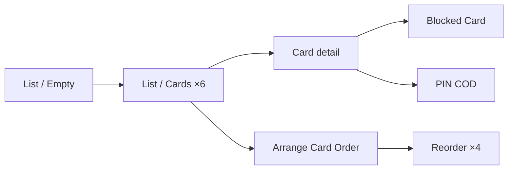
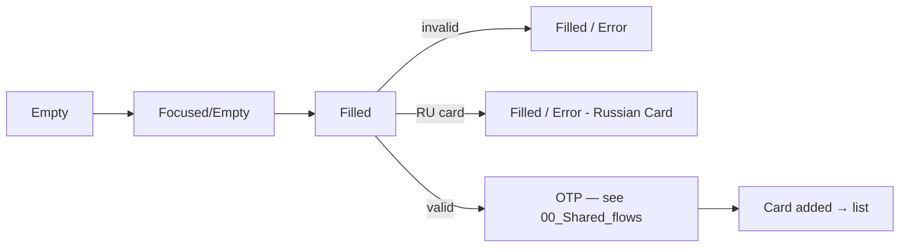
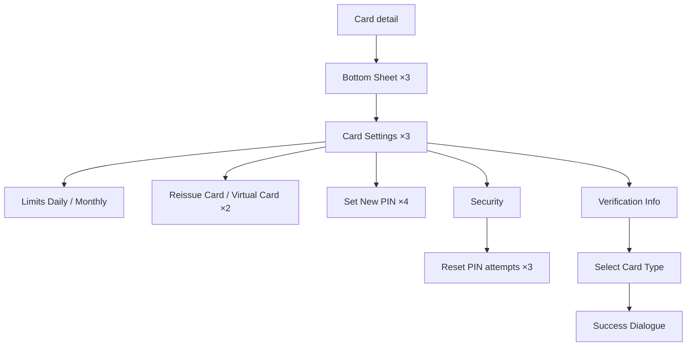
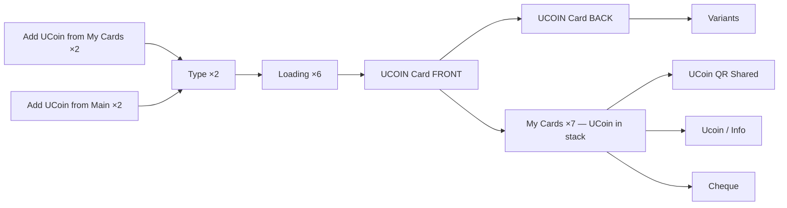

# 02 · Cards · Pillar B

Bank cards, card art, card management, plus the UCoin loyalty card. Card
list + add + bottom-sheet driven settings is the core surface; UCoin runs in
parallel with bank cards.

| Section | Page | Node ID | Frames | Status |
|---|---|---|---|---|
| Light / My Cards | Final Design | `13128:107698` | 55 | Final |
| UCoin | Final Design | `15680:105038` | 30 | Final |
| Light / My Cards | Working files | `18401:105974` | 53 | Duplicate snapshot |
| Light / My Cards / Empty | Working files | standalone | 7 | Iteration scratch |
| Light / My Cards (full-page captures, h=2438) | Working files | standalone | 2 | Capture |
| Light / My Cards / Select Card Type | Working files | standalone | 1 | Iteration |

**Total: 85 Final + ~63 WIP frames.**

The full-page captures (h=2438) and the WF snapshot are largely
re-iterations of Final — diff before any cleanup work.

---

## B.1 · Card list & detail

Source: `Light / My Cards` (`13128:107698`).

### Cluster — list states

| State | Frame |
|---|---|
| Empty | Light / My Cards / Empty |
| Cards (6 variants) | Light / My Cards / Cards |
| PIN COD | Light / My Cards / PIN COD |
| Blocked Card | Light / My Cards / Blocked Card |

### Arrange card order

4 ordering frames — drag-handle reorder for the card stack.

---

## B.2 · Add card

| State | Frame |
|---|---|
| Empty | Light / My Cards / Add Cards Form / Empty |
| Focused / Empty | Light / My Cards / Add Cards Form / Focused/Empty |
| Filled / Error | Light / My Cards / Add Cards Form / Filled/Error |
| Filled / Error - Russian Card | Light / My Cards / Add Cards Form / Filled/Error - Russian Card |
| Filled (×2) | Light / My Cards / Add Cards Form / Filled |

The form supports both UZ-format and RU-format card numbers — separate
error treatment per format.

*Reuses OTP template — see [00_Shared_flows § OTP](./00_Shared_flows.md#otp).*

---

## B.3 · Card-management bottom sheets

### Cluster — bottom sheets (`13128:107698`)

| Group | Frames |
|---|---|
| Bottom Sheet | 3 |
| Card Settings | 3 |
| Card Limits / Daily | 1 |
| Card Limits / Monthly | 2 |
| Reissue Card / Virtual Card | 2 |
| Set New PIN | 4 (Empty / Filled / Error variants) |
| Bottom sheet / Limits info | 1 |

### Security flow

| State | Frame |
|---|---|
| Security | Light / My Cards / Security |
| Reset PIN attempts | Light / My Cards / Security / Reset PIN attempts (×3) |

### Verification → card-type selection

| State | Frame |
|---|---|
| Verification Info | Light / My Cards / Verification Info |
| Select Card Type | Light / My Cards / Select Card Type |
| Success Dialogue | Light / My Cards / Success Dialogue |

*Reuses OTP template — 5 OTP states embedded inside My Cards for the
PIN-change / reissue / sensitive-action flows.*

---

## B.4 · UCoin loyalty card

UCoin is a loyalty card that lives alongside bank cards in the My Cards
stack. Two entry points: from My Cards or from Main.

Source: `UCoin` (`15680:105038`).

### Cluster

| Group | Count | Notes |
|---|---|---|
| Add from My Cards / Main | 2 + 2 | Entry-point variants |
| Type / Loading animation | 2 | Animation stage |
| Type | 2 | Card-type selection |
| Loading | 6 | Multi-step loader sequence |
| UCOIN Card FRONT / BACK / Variants | 3 | Card art on detail screen |
| My Cards (with UCoin in stack) | 7 | Stack states |
| Cheque | 1 | Earn / spend cheque |
| UCoin QR Shared | 1 | Share-by-QR |
| Ucoin / Info | 1 | Info modal / about |

Cross-references `Application menu / Applications / Address` from
[06_Pay_Services.md § F.6](./06_Pay_Services.md#f6--application-menus-card-order--address).

*Reuses cheque template — see [00_Shared_flows § Cheque](./00_Shared_flows.md#cheque).*

---

## WIP / Working files

### Light / My home — `19743:105449` · 19 frames · UNIQUE → group services by household

While "My home" is *consumed* via Pay Services, it adds a new card-like
container to the home — a household grouping that stacks services per home.
Listed here for cross-pillar reference; full flow lives in
[06_Pay_Services.md § F.7](./06_Pay_Services.md#f7--my-home-wip).

### Light / My Cards (53 frames, `18401:105974`) · DUPLICATE

Snapshot of Final-Design `Light / My Cards`. Frame names near-identical
(53 vs 55 — Final has 2 extra: `Bottom sheet / Limits info` and
`image 435`). Diff before any deletion — IDs may carry post-promotion
edits.

### Standalone iteration scratch

- `Light / My Cards / Empty` (×7) — empty-state explorations.
- `Light / My Cards / Select Card Type` (×1).
- `Light / My Cards` full-page captures (×2 at h=2438) — likely scrollable
  capture exports.

---

## Open questions (from global plan §4)

1. **UCoin vs bank cards IA** — UCoin is parallel to bank cards (separate
   add flow, separate visual treatment). Decide whether to merge IA or keep
   parallel.
2. **List Item consolidation** — 4 different `List Item` masters used
   across My Cards (`Monitoring / List Item / New`, `List item -
   Monitoring/Default`, etc.). Consolidate before redesign (global plan
   §5 Step 2).

---

## Reusable components

From `Unired_library_audit.md`:

- **Bank Card** (9 props — heavy)
- **Big-Card-Background** (46) + **Mini-Card-Background** (46) — card art variants
- **Card Input** (9) — card-number-entry composite
- **Uzbekistan Bank Logos Full** (36), **Bank Icons** (165)
- **Russian Bank Logos** (21), **Russian Bank Icons** (154)
- **Korean Bank Logos** (54)
- **Allowed cards** (2)
- **Bottom Menu** (5) + **Bottom Menu New** (4) — see [00_Shared_flows § Bottom menu](./00_Shared_flows.md#bottom-menu)
- **PIN Code** (2)
- **Loader** (8)
- **Modal - status** — for Success Dialogue
- **Stamp** (6) — cheque overlays
- **Ucoin gradient** (paint style)
