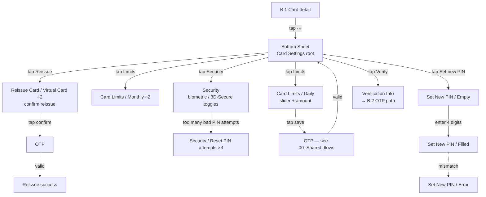

# 02 · Cards · Pillar B

Bank cards, card art, card management, plus the UCoin loyalty card. Card
list + add + bottom-sheet driven settings is the core surface; UCoin runs
in parallel with bank cards.

| Section | Page | Node ID | Frames | Status |
|---|---|---|---|---|
| Light / My Cards | Final Design | `13128:107698` | 55 | Final |
| UCoin | Final Design | `15680:105038` | 30 | Final |
| Light / My Cards | Working files | `18401:105974` | 53 | Duplicate snapshot |
| Light / My Cards / Empty | Working files | standalone | 7 | Iteration scratch |
| Light / My Cards (full-page captures, h=2438) | Working files | standalone | 2 | Capture |
| Light / My Cards / Select Card Type | Working files | standalone | 1 | Iteration |

**Total: 85 Final + ~63 WIP frames.**

---

## B.1 · Card list & detail

**Entry:** Tap "Cards" tab on bottom menu, OR Main → "Cards Added" tile.
**Exit:** Tap card → detail; Tap "+" → B.2 Add card; Tap settings →
B.3 bottom sheet.

```mermaid
flowchart LR
    Tap[Bottom menu tap "Cards"] --> Has{User has cards?}
    Has -->|no| Empty[List / Empty<br/>"Add your first card" CTA]
    Has -->|yes| List[List / Cards ×6<br/>card carousel + balance]
    Empty -->|tap "+"| Add[→ B.2 Add card]
    List -->|tap "+"| Add
    List -->|tap card| Detail[Card detail<br/>balance + actions]
    List -->|long-press / tap reorder| Order[Arrange Card Order<br/>drag-handle list]
    Detail -->|card is blocked| Blocked[Blocked Card<br/>"Unblock" CTA]
    Detail -->|Pay-On-Delivery card| PIN[PIN COD<br/>cash-on-delivery PIN]
    Detail -->|tap settings ⋯| BS[→ B.3 bottom sheet]
    Order -->|drag, tap save| List
```

### Step ledger

| # | User action | Screen | Frame |
|---|---|---|---|
| 1 | Tap "Cards" tab | List entry | (master cluster `13128:107698`) |
| 2a | (no cards) | Empty | Light / My Cards / Empty |
| 2b | (has cards) | Cards carousel | Light / My Cards / Cards (×6) |
| 3 | Tap card | Card detail | Light / My Cards / Cards (variant) |
| 3a | (card blocked) | Blocked Card screen | Light / My Cards / Blocked Card |
| 3b | (PIN COD card) | PIN-on-delivery | Light / My Cards / PIN COD |
| 4 | Tap reorder | Arrange Card Order ×4 | Light / My Cards / Arrange Card Order |
| 5 | Drag handles, tap save | Returns to List with new order | (transition) |

---

## B.2 · Add card

**Entry:** B.1 List → tap "+", OR Main → "Add card" CTA, OR onboarding
prompt.
**Exit:** Card validated → returns to B.1 List with new card; Error → stays
on form.
**Goal:** Capture card number, expiry, CVV, validate format (UZ vs RU),
issue OTP if required.

```mermaid
flowchart LR
    Add[Add Cards Form / Empty<br/>card number field empty] -->|tap field| AF[Focused / Empty<br/>numpad up]
    AF -->|type 16 digits| Filled[Filled<br/>format detected]
    Filled -->|invalid format| AE[Filled / Error<br/>red border, error message]
    Filled -->|RU format detected| AR[Filled / Error - Russian Card<br/>RU-specific message]
    AE -->|tap clear, retype| AF
    AR -->|tap clear / use UZ| AF
    Filled -->|valid, tap "Add"| Verify[Verification Info<br/>send OTP confirmation]
    Verify -->|tap "Send code"| OTP[OTP — see 00_Shared_flows]
    OTP -->|valid| Type[Select Card Type<br/>physical / virtual / linked]
    Type -->|tap type| Done[Success Dialogue<br/>card added modal]
    Done -->|tap OK| List[→ B.1 List]
```

### Step ledger

| # | User action | Screen | Frame | What's emitted |
|---|---|---|---|---|
| 1 | (arrive from B.1 / Main) | Empty form | Light / My Cards / Add Cards Form / Empty | — |
| 2 | Tap card-number field | Focused / Empty | Light / My Cards / Add Cards Form / Focused/Empty | Numpad up |
| 3 | Type 16 digits | Filled | Light / My Cards / Add Cards Form / Filled | Format auto-detected |
| 3a | (invalid Luhn) | Filled / Error | Light / My Cards / Add Cards Form / Filled/Error | Red border + msg |
| 3b | (RU format detected) | Filled / Error - Russian Card | Light / My Cards / Add Cards Form / Filled/Error - Russian Card | RU-specific copy |
| 4 | Type expiry + CVV | Filled (variant) | Light / My Cards / Add Cards Form / Filled | All fields green |
| 5 | Tap "Add card" | Verification Info | Light / My Cards / Verification Info | OTP request fired |
| 6 | Complete OTP | (OTP master) | (cross-ref) | `code_verified=true` |
| 7 | Tap card type | Select Card Type | Light / My Cards / Select Card Type | Type stored |
| 8 | (server: ok) | Success Dialogue | Light / My Cards / Success Dialogue | Card added |
| 9 | Tap OK | → B.1 List with new card | — | — |

The form supports both UZ-format and RU-format card numbers — separate
error treatment per format.

*Reuses OTP template — see [00_Shared_flows § OTP](./00_Shared_flows.md#otp).*

---

## B.3 · Card-management bottom sheets

**Entry:** B.1 Card detail → tap settings ⋯.
**Exit:** Each sub-flow returns to B.1 Card detail.

A central `Card Settings` bottom sheet acts as a hub for 6 sub-flows:
limits, reissue, set new PIN, security, verification, delete.



### Sub-flow B.3.a — Card limits

| # | User action | Screen | Frame |
|---|---|---|---|
| 1 | Tap "Limits" on bottom sheet | Daily | Light / My Cards / Card Limits / Daily |
| 2 | Slide slider, tap "Save" | Daily filled | (variant) |
| 3 | Tap "Monthly" tab | Monthly | Light / My Cards / Card Limits / Monthly (×2) |
| 4 | Tap "Save" | OTP confirmation | (cross-ref OTP) |
| 5 | Tap "Limits info" link | Limits info modal | Light / My Cards / Bottom sheet / Limits info |

### Sub-flow B.3.b — Reissue (physical or virtual)

| # | User action | Screen | Frame |
|---|---|---|---|
| 1 | Tap "Reissue" | Reissue / Physical | Light / My Cards / Reissue Card / Virtual Card (1) |
| 2 | (virtual variant) | Reissue / Virtual | Light / My Cards / Reissue Card / Virtual Card (2) |
| 3 | Tap "Confirm" | OTP | (cross-ref OTP) |
| 4 | (server: ok) | Success Dialogue | Light / My Cards / Success Dialogue |

### Sub-flow B.3.c — Set new PIN (4 states)

| # | User action | Screen | Frame |
|---|---|---|---|
| 1 | Tap "Set new PIN" | Empty | Light / My Cards / Set New Pin / Empty |
| 2 | Type 4 digits | Filled | Light / My Cards / Set New Pin / Filled |
| 3a | (mismatch on confirm) | Error | Light / My Cards / Set New Pin / Error |
| 3b | (success) | Success | Light / My Cards / Set New Pin / Success |

### Sub-flow B.3.d — Security

| # | User action | Screen | Frame |
|---|---|---|---|
| 1 | Tap "Security" | Security toggles | Light / My Cards / Security |
| 2 | Toggle biometric / 3D-Secure | (state changes) | (variant) |
| 3 | (after N bad PIN attempts) | Reset PIN attempts | Light / My Cards / Security / Reset PIN attempts (×3) |

### Sub-flow B.3.e — Verification

Verification Info → Select Card Type → Success Dialogue. Same arc as
B.2 finish but launched from existing-card context (e.g. CVV re-verify
after change of phone).

*Reuses OTP template — 5 OTP states are embedded inside My Cards for the
PIN-change / reissue / sensitive-action sub-flows. See [00_Shared_flows § OTP](./00_Shared_flows.md#otp).*

---

## B.4 · UCoin loyalty card

UCoin is a loyalty card that lives alongside bank cards in the My Cards
stack. Two entry points: from My Cards or from Main.

**Entry:**
- B.1 My Cards → "Add UCoin" CTA when no UCoin yet
- Main → "Add UCoin" prompt (×2 variants)

**Exit:** UCoin card visible in stack on B.1; QR can be shared from
detail.

```mermaid
flowchart LR
    Mc[B.1 My Cards] -->|tap "Add UCoin"| AddMC[Add UCoin from My Cards ×2]
    Main[Main / Authorized] -->|tap "Add UCoin"| AddMain[Add UCoin from Main ×2]
    AddMC --> Type[Type ×2<br/>card-type picker]
    AddMain --> Type
    Type -->|tap type| Loading[Loading ×6<br/>multi-step animation]
    Loading -->|done| CardF[UCOIN Card FRONT<br/>card art]
    CardF -->|tap flip| CardB[UCOIN Card BACK]
    CardB -->|tap variants| Variants[Variants picker]
    CardF -->|tap "QR"| QR[UCoin QR Shared<br/>full-screen QR]
    CardF -->|tap info ⓘ| Info[Ucoin / Info]
    CardF -->|earn / spend| Cheque[Cheque<br/>UCoin transaction receipt]
    CardF -->|back| List[B.1 My Cards × UCoin in stack ×7]
```

### Step ledger

| # | User action | Screen | Frame |
|---|---|---|---|
| 1a | Tap "Add UCoin" on My Cards | Entry from cards | Add UCoin card from My Cards (×2) |
| 1b | Tap "Add UCoin" on Main | Entry from main | Add UCoin card from Main (×2) |
| 2 | (loading animation start) | Type / Loading animation | Add UCoin card / Type / Loading animation (×2) |
| 3 | Pick UCoin card type | Type ×2 | Add UCoin card / Type (×2) |
| 4 | (multi-step loading) | Loading × 6 sequential frames | Loading (×6) |
| 5 | (done) | UCOIN Card FRONT | UCOIN Card FRONT |
| 6 | Tap flip | UCOIN Card BACK | UCOIN Card BACK |
| 7 | Tap variants | Variants picker | UCOIN Variants |
| 8 | Tap QR | QR Shared full-screen | UCoin QR Shared |
| 9 | Tap info | Info modal | Ucoin / Info |
| 10 | (transaction earn / spend) | Cheque | UCoin Cheque |
| 11 | Back | My Cards with UCoin in stack | My Cards (×7 — UCoin visible) |

Cross-references `Application menu / Applications / Address` from
[06_Pay_Services.md § F.6](./06_Pay_Services.md#f6--application-menus-card-order--address).

*Reuses cheque template — see [00_Shared_flows § Cheque](./00_Shared_flows.md#cheque).*

---

## WIP / Working files

### Light / My home — `19743:105449` · 19 frames · UNIQUE

While "My home" is *consumed* via Pay Services, it adds a new card-like
container to the home — a household grouping that stacks services per home.
Listed here for cross-pillar reference; full flow lives in
[06_Pay_Services.md § F.7](./06_Pay_Services.md#f7--my-home-wip).

### Light / My Cards (53 frames, `18401:105974`) · DUPLICATE

Snapshot of Final-Design `Light / My Cards`. Frame names near-identical
(53 vs 55 — Final has 2 extra: `Bottom sheet / Limits info` and
`image 435`). Diff before any deletion — IDs may carry post-promotion
edits.

### Standalone iteration scratch

- `Light / My Cards / Empty` (×7) — empty-state explorations (different
  illustrations, copy variants, CTA placements).
- `Light / My Cards / Select Card Type` (×1) — alternative card-type
  picker treatment.
- `Light / My Cards` full-page captures (×2 at h=2438) — likely scrollable
  capture exports for marketing or design review.

---

## Open questions (from global plan §4)

1. **UCoin vs bank cards IA** — UCoin is parallel to bank cards (separate
   add flow, separate visual treatment). Decide whether to merge IA or
   keep parallel. Merging would simplify B.1's "+" CTA into a single
   chooser (Bank card / UCoin / Linked).
2. **List Item consolidation** — 4 different `List Item` masters used
   across My Cards (`Monitoring / List Item / New`, `List item -
   Monitoring/Default`, etc.). Consolidate before redesign (global plan
   §5 Step 2).

---

## Reusable components

From `Unired_library_audit.md`:

- **Bank Card** (9 props — heavy) — the interactive card visualisation
- **Big-Card-Background** (46) + **Mini-Card-Background** (46) — card art
  variants per bank
- **Card Input** (9) — card-number-entry composite (used by B.2)
- **Uzbekistan Bank Logos Full** (36), **Bank Icons** (165) — UZ banks
- **Russian Bank Logos** (21), **Russian Bank Icons** (154) — RU banks
- **Korean Bank Logos** (54) — KR banks (relevant for cross-border cards)
- **Allowed cards** (2) — accepted-cards strip
- **Bottom Menu** (5) + **Bottom Menu New** (4) — see [00_Shared_flows § Bottom menu](./00_Shared_flows.md#bottom-menu)
- **PIN Code** (2) — PIN-dot row (used by B.3.c)
- **Loader** (8) — used by UCoin's 6-frame loading sequence
- **Modal - status** — Success Dialogue
- **Stamp** (6) — cheque overlays
- **Ucoin gradient** (paint style) — UCoin card art
- **Switch** (4) — Security toggles in B.3.d
