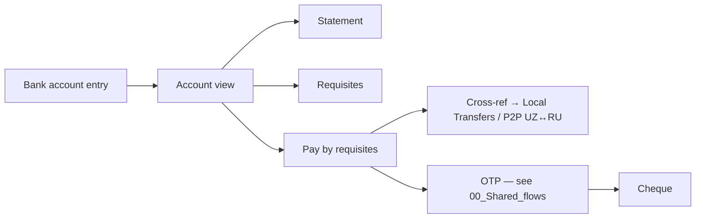
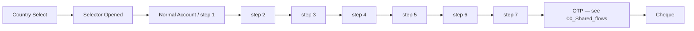

# 03 · Bank Account · Pillar C

Bank account number, requisites, account statements, and payment by bank
requisites. **The smallest pillar by flow count, but flagged with the most
hygiene issues** — two duplicate sections + one unique WIP that hasn't been
promoted.

| Section | Page | Node ID | Frames | Status |
|---|---|---|---|---|
| Bank account (v1) | Final Design | `17273:118008` | 58 | Final — duplicate ⚠ |
| Bank account (v2) | Final Design | `17155:121512` | 52 | Final — duplicate ⚠ |
| Light / Requisite | Working files | `15836:170962` | 9 | **WIP — unique** |

**Total: 110 Final + 9 WIP = 119 frames.**

---

## C.1 · Bank account view (canonical needed)

Both sections are named "Bank account" with **near-identical frame names**.
Cross-references inside both: OTP states, P2P / Local Transfers, P2P / UZ →
Russia. Until reconciliation, treat both as candidates.

The two sections both contain heavy `Light / Bank account` repetition. The
difference is in IDs only — names match. **Open question §4.2 of the global
plan blocks any further work here.**

*Reuses OTP template — see [00_Shared_flows § OTP](./00_Shared_flows.md#otp).*
*Reuses cheque template — see [00_Shared_flows § Cheque](./00_Shared_flows.md#cheque).*

---

## C.2 · Cross-pillar links

Bank account screens reference (do not own) these flows:

- **Local Transfers** — payment by requisites can fund a UZ↔UZ local
  transfer. See [04_Move_Money_Local.md § D.1](./04_Move_Money_Local.md#d1--mahalliy-otkazmalar--uzuz-local-transfers).
- **P2P UZ → Russia** — payment by requisites also feeds the cross-border
  RU corridor. See [05_Move_Money_Cross_Border.md § E.4](./05_Move_Money_Cross_Border.md#e4--p2p-russia--uzbekistan-dedicated).

---

## WIP / Working files

### Light / Requisite — `15836:170962` · 9 frames · UNIQUE

Bank-requisites (RU IBAN-style) transfer flow — **does not exist on Final
Design**, so this is a genuinely missing feature.

| # | Frame |
|---|---|
| 1 | Requisite / Country Select |
| 2 | Requisite / Selector Opened |
| 3–9 | Requisite / Normal Account (×7 step variants) |

**Promote-ready.** Pick canonical screens, create a new `Light / Requisite`
section on Final Design (global plan §5 Step 1).

---

## Open questions (from global plan §4)

1. **Bank account reconciliation (§4.2)** — there are two `Bank account`
   sections (58 + 52 frames). Pick one as canonical, archive the other.
   Diff by ID first — IDs differ even where names match, so post-promotion
   edits may exist on either side.
2. **Promote Requisite (§5 Step 1)** — Working-files Requisite is the only
   bank-requisites payment treatment in the file. No matching Final flow.

---

## Reusable components

From `Unired_library_audit.md`:

- **Country Flags** (96 variants) — country selector
- **Input** (35) — account-number / IBAN entry
- **Section Heading** — section dividers
- **Bottom Menu** (5) — see [00_Shared_flows § Bottom menu](./00_Shared_flows.md#bottom-menu)
- **Stamp** (6) — cheque overlay
- **Modal - status** — confirmation modals
- **Russian Bank Logos** (21) + **Russian Bank Icons** (154) — for RU IBAN
  bank picker inside Requisite
