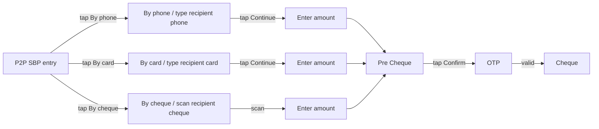

# 04 · Move Money — Local · Pillar D

UZ ↔ UZ in-country money movement. Two canonical flows on Final Design
(Mahalliy o'tkazmalar via Visa-network, P2P SBP via phone/card/cheque) plus
a presentation-only PTP Wallet section. UCash (Western-Union-style cash
transfer) is the unique WIP.

| Section | Page | Node ID | Frames | Status |
|---|---|---|---|---|
| Mahalliy o'tkazmalar | Final Design | `15065:97898` | 41 | Final |
| Light / P2P SBP | Final Design | (in P2P) | 13 | Final |
| PTP Wallet | Final Design | `21309:124234` | 11 | Final — presentation copy |
| Light / Ucash V1 | Working files | `19743:105949` | 21 | **WIP** |
| Light / Ucash V2 | Working files | `19743:106657` | 10 | **WIP** |

**Total: 65 Final + 31 WIP = 96 frames.**

> Note on P2P SBP — referenced inline by `Mahalliy` and `Light / P2P` but
> framed in the global plan as a Pillar D capability. Audit file groups it
> with the in-country flows; full screen list lives inside `Light / P2P`.

---

## D.1 · Mahalliy o'tkazmalar — UZ↔UZ local transfers

**Entry:** Main → "Local transfers" tile, OR Bottom menu / Payment →
"Transfers", OR C.2 (Pay by requisites for UZ recipient).
**Exit:** Cheque (success / error / hold).
**Goal:** transfer money from a Unired card to another card in
Uzbekistan via the Visa local network.

```mermaid
flowchart LR
    Main[Main / Authorized] -->|tap Local transfers| Entry[P2P / Local Transfers root]
    Entry -->|tap Transfer to Visa| Visa0[Transfer To Visa / Enter Amount<br/>numpad up, amount empty]
    Visa0 -->|type amount| Visa1[Amount Filled / Focused]
    Visa1 -->|tap Next| Visa2[Amount Filled<br/>amount confirmed]
    Visa2 -->|tap card field| Card0[Card Filled / Focused<br/>card-number entry]
    Card0 -->|type 16 digits| Card1[Filled Fields<br/>recipient card validated]
    Card1 -->|tap Continue| Pre[Pre Cheque<br/>review amount + recipient + fee]
    Pre -->|tap Confirm| OTP[OTP — see 00_Shared_flows]
    OTP -->|valid| Ch[Cheque ×3<br/>success / error / hold]
    Ch -->|tap Save as recurring| FT[Transfers / Fast transfers setted up]
    FT -->|tap OK| Main
```

### Step ledger

| # | User action | Screen | Frame |
|---|---|---|---|
| 1 | Tap Local transfers on Main | Local Transfers entry | P2P / Local Transfers (entry variant) |
| 2 | Tap Transfer to Visa / pick recipient mode | Transfer To Visa entry | P2P / Transfer To Visa / Enter Amount |
| 3 | Tap amount field, type | Amount Filled / Focused | P2P / Transfer To Visa / Amount Filled / Focused |
| 4 | (blur) | Amount Filled | P2P / Transfer To Visa / Amount Filled |
| 5 | Tap recipient-card field | Card Filled / Focused | P2P / Transfer To Visa / Card Filled / Focused |
| 6 | Type recipient card number | Filled Fields | P2P / Transfer To Visa / Filled Fields |
| 7 | Tap Continue | Pre Cheque | (Pre Cheque variant of Local Transfers) |
| 8 | Tap Confirm | OTP Empty | (cross-ref OTP master) |
| 9 | Type code | OTP Filled | (cross-ref) |
| 10 | (server response) | Cheque ×3 (success / error / hold) | (cross-ref Shared cheque) |
| 11 | (success) Tap Save as recurring | Fast transfers setted up | Transfers / Fast transfers setted up |
| 12 | Tap OK / Done | → Main | — |

### Cluster

| Group | Count |
|---|---|
| P2P / Local Transfers (step variants) | ~25 |
| P2P / Transfer To Visa (Enter Amount → Amount Filled/Focused → Amount Filled → Card Filled/Focused → Filled Fields) | 5 |
| Cheque | 3 |
| OTP states | 5 |
| Transfers / Fast transfers setted up | 1 |

The **Fast transfers setted up** state stores recurring local-transfer
recipients for a 1-tap repeat — surfaces on Main and inside other transfer
sections.

*Reuses OTP template — see [00_Shared_flows § OTP](./00_Shared_flows.md#otp).*
*Reuses cheque template — see [00_Shared_flows § Cheque](./00_Shared_flows.md#cheque).*

---

## D.2 · P2P SBP — phone / card / cheque local transfer

**Entry:** Main → "P2P SBP" tile, OR D.1 entry → "By phone" tab.
**Exit:** Cheque.

A SBP-style (Russian System for Fast Payments mirror) UZ↔UZ flow keyed on
phone number rather than card. 13 frames inside the broader `Light / P2P`
section.

Per the global plan, P2P SBP screens live inside `Light / P2P` but cover
**in-country** Visa-direct-style flows that use phone resolution.

---

## D.3 · PTP Wallet — references-only section

**Entry:** demo / sales presentation (suspected — see open question §4.9).
**Exit:** N/A — section appears to be deck-style copy.

Source: `PTP Wallet` (`21309:124234`). 11 frames.

This section is a **presentation copy**, not a new feature. Frames inside
are direct cross-references:
- `P2P / Local Transfers` (×5) — pulled from Mahalliy o'tkazmalar (D.1)
- `P2P / UZ - TJ / By phone number` (×5) — pulled from Light / P2P (E.2)
- Country selector (×1)

Likely a deck-style slide showing P2P+local capability in one composite —
delete after the global-plan §4.9 review confirms it's a duplicate.

---

## WIP / Working files

### D.4 · Light / Ucash V1 — `19743:105949` · 21 frames · UNIQUE

UCash = cash-money transfer (Western-Union-style: sender deposits cash,
recipient picks up cash). Doesn't exist on Final Design.

**Entry:** Main → "Cash transfer" tile (once promoted), OR Payment → "Cash
out".
**Exit:** Final cheque + monitoring entry.
**Goal:** create a cash-pickup transaction with a code the recipient uses
at a Unired-affiliated location.

```mermaid
flowchart LR
    Main[Main] -->|tap Cash transfer| E[Cash money transfers ×2<br/>entry screen]
    E -->|tap New transfer| Amt0[Enter amount<br/>numpad up]
    Amt0 -->|type digits| Amt1[Numpad / 8 variants<br/>each digit add updates display]
    Amt1 -->|tap Next| Recv[Receiver info ×2<br/>name + phone]
    Recv -->|tap Continue| Pre[Pre check<br/>review]
    Pre -->|tap Confirm| Det1[Transfer details / step 1]
    Det1 --> Det2[Transfer details / step 2]
    Det2 --> Det3[Transfer details / step 3]
    Det3 --> Det4[Transfer details / step 4]
    Det4 -->|tap Issue cheque| Check[Check / final cheque<br/>pickup code visible]
    Check -->|tap Track| Mon[→ I.2 Monitoring]
```

### Step ledger

| # | User action | Screen | Frame |
|---|---|---|---|
| 1 | Tap Cash transfer on Main | Entry 1 | Cash money transfers (1) |
| 2 | Tap New | Entry 2 | Cash money transfers (2) |
| 3 | (numpad shows) | Enter amount | Enter amount (1) |
| 4–11 | Type each digit | Enter amount (×8 numpad variants) | Enter amount (2..8) |
| 12 | Tap Next | Receiver info 1 | Receiver info (1) |
| 13 | Type receiver name + phone | Receiver info 2 | Receiver info (2) |
| 14 | Tap Continue | Pre check | Pre check |
| 15 | Tap Confirm | Transfer details (1..4) | Transfer details (×4) |
| 16 | Tap Issue cheque | Final cheque with pickup code | Check |
| 17 | Tap Track | → I.2 Monitoring | (cross-ref) |

Cross-references inside V1:
- `P2P / UZ - KR / Step - 2 / History select` — pulls a recipient from KR
  history (probably for repeat cash transfers).

### D.5 · Light / Ucash V2 — `19743:106657` · 10 frames · UNIQUE

Trimmed alternate cut of the same flow. Different amount-entry treatment
(6 numpad variants vs V1's 8) and only 2 transfer-details screens.

| Group | V1 | V2 | Diff |
|---|---|---|---|
| Cash money transfers (entry) | 2 | 1 | V2 single-screen entry |
| Enter amount (numpad variants) | 8 | 6 | V2 trimmer |
| Receiver info | 2 | 0 | **Missing in V2** |
| Pre check | 1 | 0 | **Missing in V2** |
| Transfer details | 4 | 2 | V2 trimmer |
| Check (final cheque) | 1 | 0 | **Missing in V2** |
| Monitoring (cross-ref) | 1 | 0 | — |
| `P2P / UZ - KR / Step - 2 / History select` (cross-ref) | 1 | 1 | Both |
| Transfers / Fast transfers setted up | 0 | 1 | **V2-only** |

**V2 is incomplete** — no receiver-info, pre-check, or final-cheque
screens. V1 covers the full arc and should be the canonical promotion
candidate (global plan §4.3 / §5 Step 1).

---

## Open questions (from global plan §4)

1. **PTP Wallet (§4.9)** — confirm whether it's a real feature or just a
   presentation copy of P2P + Local Transfers. Recommend delete.
2. **UCash V1 vs V2 (§4.3)** — V1 (21 frames, full arc) vs V2 (10 frames,
   incomplete). Recommend V1.

---

## Reusable components

From `Unired_library_audit.md`:

- **Card Input** (9) — recipient-card-number entry (D.1)
- **Input** (35) — phone / amount entry
- **Country Flags** (96) — country selector (D.3 PTP Wallet)
- **Transfer Flags** (13) — transfer-type indicators
- **Transfer 3D icons** (9)
- **Transfer App logos** (5)
- **Stamp** (6) — cheque status overlays
- **Loader** (8) — payment / OTP loading
- **Bottom Menu** (5) — see [00_Shared_flows § Bottom menu](./00_Shared_flows.md#bottom-menu)
- **Modal - status** — pre-cheque / success modals
- **Action Buttons Section** — final cheque action rail
- **Saved** (4) — saved-recipient indicator (Fast transfers)
