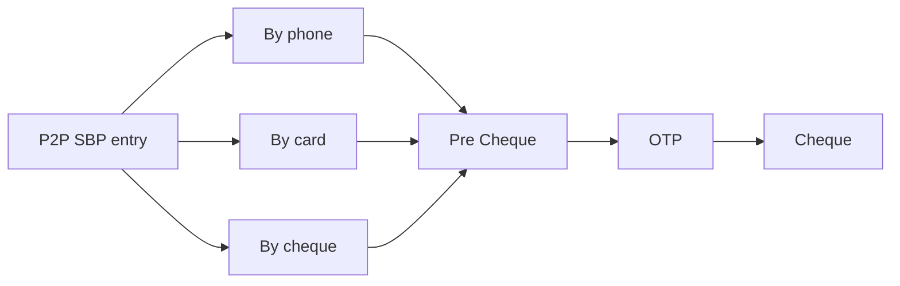

# 04 · Move Money — Local · Pillar D

UZ ↔ UZ in-country money movement. Two canonical flows on Final Design
(Mahalliy o'tkazmalar via Visa-network, P2P SBP via phone/card/cheque) plus
a presentation-only PTP Wallet section. UCash (Western-Union-style cash
transfer) is the unique WIP.

| Section | Page | Node ID | Frames | Status |
|---|---|---|---|---|
| Mahalliy o'tkazmalar | Final Design | `15065:97898` | 41 | Final |
| Light / P2P SBP | Final Design | (in P2P) | 13 | Final |
| PTP Wallet | Final Design | `21309:124234` | 11 | Final — presentation copy |
| Light / Ucash V1 | Working files | `19743:105949` | 21 | **WIP** |
| Light / Ucash V2 | Working files | `19743:106657` | 10 | **WIP** |

**Total: 65 Final + 31 WIP = 96 frames.**

> Note on P2P SBP — referenced inline by `Mahalliy` and `Light / P2P` but
> framed in the global plan as a Pillar D capability. Audit file groups it
> with the in-country flows; full screen list lives inside `Light / P2P`.

---

## D.1 · Mahalliy o'tkazmalar — UZ↔UZ local transfers

```mermaid
flowchart LR
    Entry[P2P / Local Transfers] --> Type[Pick transfer type]
    Type --> Visa[Transfer To Visa / Enter Amount]
    Visa --> AmtF[Amount Filled / Focused]
    AmtF --> Amt[Amount Filled]
    Amt --> Card[Card Filled / Focused]
    Card --> Filled[Filled Fields]
    Filled --> Pre[Pre Cheque]
    Pre --> OTP[OTP — see 00_Shared_flows]
    OTP --> Ch[Cheque ×3]
    Ch --> FT[Fast transfers setted up]
```

Source: `Mahalliy o'tkazmalar` (`15065:97898`). 41 frames.

### Cluster

| Group | Count |
|---|---|
| P2P / Local Transfers (step variants) | ~25 |
| P2P / Transfer To Visa (Enter Amount → Amount Filled/Focused → Amount Filled → Card Filled/Focused → Filled Fields) | 5 |
| Cheque | 3 |
| OTP states | 5 |
| Transfers / Fast transfers setted up | 1 |

The **Fast transfers setted up** state stores recurring local-transfer
recipients for a 1-tap repeat — surfaces on Main and inside other transfer
sections.

*Reuses OTP template — see [00_Shared_flows § OTP](./00_Shared_flows.md#otp).*
*Reuses cheque template — see [00_Shared_flows § Cheque](./00_Shared_flows.md#cheque).*

---

## D.2 · P2P SBP — phone / card / cheque local transfer

A SBP-style (Russian System for Fast Payments mirror) UZ↔UZ flow keyed on
phone number rather than card. 13 frames inside the broader `Light / P2P`
section.

Per the global plan, P2P SBP screens live inside `Light / P2P` but cover
**in-country** Visa-direct-style flows that use phone resolution.

---

## D.3 · PTP Wallet — references-only section

Source: `PTP Wallet` (`21309:124234`). 11 frames.

This section is a **presentation copy**, not a new feature. Frames inside
are direct cross-references:
- `P2P / Local Transfers` (×5) — pulled from Mahalliy o'tkazmalar
- `P2P / UZ - TJ / By phone number` (×5) — pulled from Light / P2P
- Country selector (×1)

Likely a deck-style slide showing P2P+local capability in one composite —
delete after the global-plan §4.9 review confirms it's a duplicate.

---

## WIP / Working files

### Light / Ucash V1 — `19743:105949` · 21 frames · UNIQUE

UCash = cash-money transfer (Western-Union-style: sender deposits cash,
recipient picks up cash). Doesn't exist on Final Design.

| Group | Count |
|---|---|
| Cash money transfers (entry) | 2 |
| Enter amount (numpad variants) | 8 |
| Receiver info | 2 |
| Pre check | 1 |
| Transfer details | 4 |
| Check (final cheque) | 1 |
| Monitoring (cross-ref) | 1 |
| `P2P / UZ - KR / Step - 2 / History select` (cross-ref) | 1 |

### Light / Ucash V2 — `19743:106657` · 10 frames · UNIQUE

Trimmed alternate cut of the same flow:
- Cash money transfers entry (1)
- Enter amount (×6)
- Transfer details (×2)
- P2P UZ-KR cross-ref (×1)
- Transfers / Fast transfers setted up (×1)

**Promote candidate** — pick the canonical version (V1's full arc vs V2's
trimmer cut), then promote (global plan §4.3 / §5 Step 1).

---

## Open questions (from global plan §4)

1. **PTP Wallet (§4.9)** — confirm whether it's a real feature or just a
   presentation copy of P2P + Local Transfers. Recommend delete.
2. **UCash V1 vs V2 (§4.3)** — pick one (21 frames vs 10 frames) and
   promote.

---

## Reusable components

From `Unired_library_audit.md`:

- **Card Input** (9) — card-number entry
- **Input** (35) — phone / amount entry
- **Country Flags** (96) — country selector (PTP Wallet)
- **Transfer Flags** (13)
- **Transfer 3D icons** (9)
- **Transfer App logos** (5)
- **Stamp** (6) — cheque status overlays
- **Loader** (8) — payment / OTP loading
- **Bottom Menu** (5) — see [00_Shared_flows § Bottom menu](./00_Shared_flows.md#bottom-menu)
- **Modal - status** — pre-cheque / success modals
- **Action Buttons Section** — final cheque action rail
