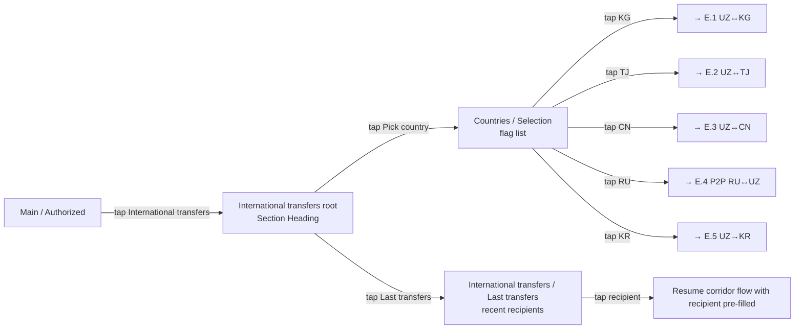
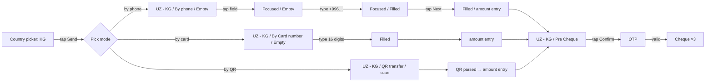
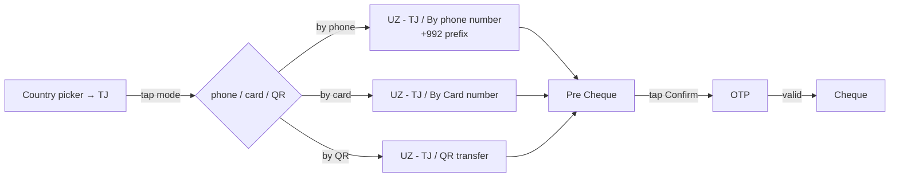
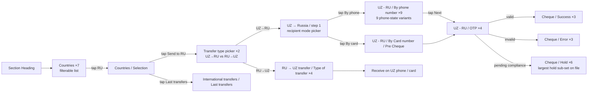
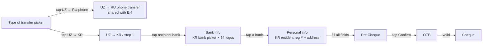
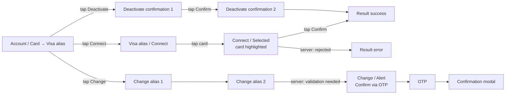

# 05 · Move Money — Cross-border · Pillar E

The largest pillar by frame count and the heart of Unired's cross-border
remittance product. Five corridors covered: UZ ↔ KG / TJ / CN / RU / KR.

| Section | Page | Node ID | Frames | Status |
|---|---|---|---|---|
| Light / P2P (all corridors UZ↔KG/TJ/CN/RU) | Final Design | `15680:108656` | **175** | Final — largest section in file |
| P2P Russia ↔ Uzbekistan (dedicated) | Final Design | `21328:122978` | 54 | Final |
| Wallet transfer all (UZ→RU + UZ→KR) | Final Design | `21328:122675` | 14 | Final |
| Light / Visa direct | Final Design | `19581:195976` | 16 | Final |
| Light / Visa alias | Final Design | `19534:113178` | 16 | Final |

**Total: 275 Final frames — the densest pillar in the file.**

> **Audit hint:** treat `Light / P2P` (175) by **corridor**, not
> chronologically. Each corridor (UZ↔KG, UZ↔TJ, UZ↔CN, UZ↔RU) has its own
> by-phone / by-card / QR / pre-cheque + state-set sub-flow. Audit each
> corridor as its own mini-section.

---

## E.0 · Universal cross-border skeleton

**Entry:** Main → "International transfers" tile, OR Bottom menu →
Payment → "International".
**Exit:** Cheque (success / error / hold).
**Goal:** route money to a recipient in a different country, picking the
corridor + recipient mode + amount + funding card.

**Universal step skeleton (every corridor):**

| # | User action | Screen | Concrete frame example (KG) |
|---|---|---|---|
| 1 | Tap International transfers | Section Heading | International transfers / Section Heading |
| 2 | Pick country | Countries / Selection | International transfers / Countries / Selection |
| 3 | Pick transfer type | Transfer type picker | RU → UZ transfer / Type of transfer |
| 4 | Pick recipient mode (phone / card / QR / requisites) | Mode-specific entry | P2P / UZ - KG / By phone / Empty |
| 5 | Type recipient identifier | Mode-specific filled | P2P / UZ - KG / By phone / Filled |
| 6 | Type amount | Amount filled | (variant) |
| 7 | Pick funding card | Card-picked | (variant) |
| 8 | Tap Continue | Pre Cheque | P2P / UZ - KG / Pre Cheque |
| 9 | Tap Confirm | OTP Empty | (cross-ref OTP) |
| 10 | Type code | OTP Filled | (cross-ref) |
| 11 | (server response) | Cheque ×3 (success / error / hold) | (cross-ref Shared cheque) |

*Reuses OTP template — see [00_Shared_flows § OTP](./00_Shared_flows.md#otp).*
*Reuses cheque template — see [00_Shared_flows § Cheque](./00_Shared_flows.md#cheque).*

---

## E.1 · UZ ↔ KG (Kyrgyzstan)

**Entry:** E.0 country picker → tap KG.
**Exit:** Cheque.
**Recipient modes:** by phone, by card, by QR.

Multiple frames named `P2P / UZ - KG / By Card number` exist —
cross-reference by **ID** not name. Full state-set per mode:
empty / focused / filled / error / pre-cheque / OTP / success.

### Step ledger — by phone (most common)

| # | User action | Screen | Frame |
|---|---|---|---|
| 1 | (arrive from country picker) | Mode picker | P2P / UZ - KG / Type picker |
| 2 | Tap By phone | Empty phone field | P2P / UZ - KG / By phone / Empty |
| 3 | Tap field | Focused / Empty | P2P / UZ - KG / By phone / Focused/Empty |
| 4 | Type +996 + 9 digits | Focused / Filled | P2P / UZ - KG / By phone / Focused/Filled |
| 5 | Tap Next | Amount-entry screen | P2P / UZ - KG / By phone / Filled |
| 6 | Type amount | Amount + Card | (variant) |
| 7 | Tap Continue | Pre Cheque | P2P / UZ - KG / Pre Cheque |
| 8 | Tap Confirm | → OTP | (Shared) |
| 9 | (after OTP) | Cheque | (Shared) |

---

## E.2 · UZ ↔ TJ (Tajikistan)

Same flow shape as KG. By phone · By card · QR · Pre Cheque. Inside
`Light / P2P`. Phone prefix +992.

Cross-referenced from the PTP Wallet presentation block (5 frames pinned).

---

## E.3 · UZ ↔ CN (China)

The thinnest corridor. Inside `Light / P2P`. **Coverage gap** — only
Empty + Focused frames documented; full happy-path likely missing.

| State | User action | Screen | Frame |
|---|---|---|---|
| Empty | (arrive from country picker → CN) | Recipient empty | P2P / UZ - CN / Empty |
| Focused | Tap field | Recipient focused | P2P / UZ - CN / Focused |
| Filled / Pre Cheque / OTP / Cheque | (not documented in audit) | (likely shared cross-refs) | — |

Newer / less developed than KG and TJ. Likely a recent addition. May lack
full state coverage — flagged as an open question.

---

## E.4 · P2P Russia ↔ Uzbekistan (dedicated)

Source: `P2P Russia ↔ Uzbekistan` (`21328:122978`). 54 frames — the most
state-rich corridor on the file. Dedicated section because RU↔UZ is the
highest-volume corridor.

**Entry:** E.0 country picker → tap RU, OR Main → "RU transfer" tile (if
shown).
**Exit:** Cheque.
**Recipient modes:** by phone, by card-number, by requisites (cross-ref C.1).

### Step ledger — UZ → RU by phone

| # | User action | Screen | Frame |
|---|---|---|---|
| 1 | Tap International transfers | Section heading | Section Heading |
| 2 | Tap Russia | Countries / Selection | Countries / Selection |
| 3 | Tap Send to RU | Transfer type picker | Countries / Transfer type (1) |
| 4 | Tap UZ → RU | UZ → Russia entry | UZ → Russia (1) |
| 5 | Tap By phone | UZ - RU / By phone empty | UZ - RU / By phone number (1) |
| 6 | Type recipient phone | filled phone | UZ - RU / By phone number (2..9 variants) |
| 7 | Tap Next | amount entry | UZ → Russia (2..6) |
| 8 | Tap card field | funding-card picker | UZ → Russia (7..10) |
| 9 | Tap Continue | Pre Cheque | UZ → Russia / Pre |
| 10 | Tap Confirm | OTP Empty | UZ - RU / OTP (1) |
| 11 | Type / autofill code | OTP Filled | UZ - RU / OTP (2..4) |
| 12 | (server: success) | Cheque / Success | RU - UZ / Cheque / Success (×3) |
| 12' | (server: error — blocked recipient, etc.) | Cheque / Error | RU - UZ / Cheque / Error (×3) |
| 12'' | (server: pending compliance) | Cheque / Hold | RU - UZ / Cheque / Hold (×6) |
| 13 | (success) Tap Track | → I.2 Monitoring | (cross-ref) |
| 13' | (hold) Tap Track | → I.2 Monitoring | (cross-ref) |

### Cluster — RU↔UZ counts

| Group | Count |
|---|---|
| Section Heading | 1 |
| International transfers / Countries | 7 |
| Countries / Selection | 1 |
| Countries / Transfer type | 2 |
| RU → UZ transfer / Type of transfer | 4 |
| RU - UZ / Cheque / Success | 3 |
| RU - UZ / Cheque / Error | 3 |
| RU - UZ / Cheque / **Hold** | **6** (largest sub-set on file) |
| UZ - RU / OTP | 4 |
| UZ → Russia (base flow) | 10 |
| UZ - RU / By phone number | 9 |
| UZ - RU / By Card number / Pre Cheque | 2 |
| International transfers / Last transfers | 1 |

The 6-frame `Hold` cheque sub-set is unique to this corridor — the RU
remittance pipeline has the most ambiguous "pending" status surface
(compliance review, partner-bank verification, AML hold) and needs the
richest UI for it.

---

## E.5 · UZ → KR (Korea) — via Wallet transfer all

Source: `Wallet transfer all (e.g. GME)` (`21328:122675`). 14 frames.

**Entry:** E.0 country picker → tap KR (or via Wallet transfer all entry).
**Exit:** Cheque.
**Goal:** transfer to a Korean recipient via a remittance partner (GME),
requiring KR-bank-info + KR-personal-info collection.

### Step ledger

| # | User action | Screen | Frame |
|---|---|---|---|
| 1 | Tap UZ → KR on type picker | Type picker | Wallet transfer all / Type picker |
| 2 | Tap recipient-bank field | KR bank picker | Wallet transfer all / Bank info |
| 3 | Tap a Korean bank (e.g. KEB Hana, KB) | Bank selected | (variant — uses Korean Bank Logos × 54) |
| 4 | Tap Continue | Personal info form | Wallet transfer all / Personal info |
| 5 | Type recipient resident reg # + address + phone | Filled form | (variant) |
| 6 | Type amount + currency | Amount filled | (variant) |
| 7 | Pick funding card | Card-picked | (variant) |
| 8 | Tap Continue | Pre Cheque | Wallet transfer all / Pre Cheque |
| 9 | Tap Confirm | → OTP | (Shared) |
| 10 | (after OTP) | Cheque | (Shared) |

Korea-specific differences vs other corridors:
- Transfer type pickers (KR vs RU)
- **Bank info** screen — sender picks recipient's KR bank from `Korean
  Bank Logos` (54-variant set)
- **Personal info** — KR-specific KYC fields (resident registration number,
  recipient address)
- Pre-cheque before OTP

This section also hosts the canonical `UZ → RU phone transfer` panel — the
"GME" naming hints at integration with a remittance partner.

---

## E.6 · Visa Direct — card-number entry

Source: `Light / Visa direct` (`19581:195976`). 16 frames.

**Entry:** E.0 country picker → tap "Send via Visa Direct", OR specific
corridor → "Visa Direct" mode.
**Exit:** Cheque.
**Goal:** push-to-card remittance — recipient's card number is sufficient
(no phone / no bank).

```mermaid
flowchart LR
    Entry[Visa Direct entry] -->|tap card field| Empty1[Card number / Empty / step 1]
    Empty1 --> Empty2[step 2]
    Empty2 --> Empty3[step 3]
    Empty3 --> Empty4[step 4]
    Empty4 --> Empty5[step 5]
    Empty5 -->|tap Continue| FF1[Focused & Filled / step 1]
    FF1 --> FF2[step 2]
    FF2 --> FF3[step 3]
    FF3 --> FF4[step 4]
    FF4 --> FF5[step 5]
    FF5 --> FF6[step 6]
    FF6 -->|tap Continue| Final1[Visa Direct / final 1]
    Final1 --> Final2[final 2]
    Final2 --> Final3[final 3]
    Final3 --> Final4[final 4]
    Final4 --> Final5[final 5]
    Final5 --> OTP[OTP]
    OTP --> Cheque[Cheque]
```

| Group | Count |
|---|---|
| Visa Direct / Card number (base 5 step) | 5 |
| Card number / Focused & Filled (6 step) | 6 |
| Visa Direct (final 5 step) | 5 |

Visa Direct ships a card-number-entry experience tailored to push-to-card
remittance. State-rich form-focus progression — every focus / filled
combination gets its own frame (presumably for an animation showcase or
multi-step entry pattern).

---

## E.7 · Visa Alias — connect / change / deactivate

Source: `Light / Visa alias` (`19534:113178`). 16 frames.

**Entry:** Account → "Visa alias" CTA, OR My Cards → card detail → "Bind
alias".
**Exit:** Returns to Account / My Cards with alias state changed.
**Goal:** bind a phone number to a Visa card so inbound remittances can
be routed by phone (recipient never shares card number).

| Group | Count |
|---|---|
| Visa alias / Connect | 1 |
| Connect / Selected | 1 |
| Change alias | 2 |
| Deactivate confirmation | 2 |
| Change | 1 |
| Result | 2 |
| Confirmation | 1 |
| Change / Alert | 1 |
| Section heading description | 3 |
| Button Group | 1 |
| Light / My Cards (cross-ref) | 1 |

Visa Alias = bind a phone number to a Visa card number for inbound
remittance.

---

## Open questions (from global plan §4)

1. **P2P 175-frame audit (§Risk register)** — the section is too dense to
   audit in one pass. Break by corridor; treat each corridor as its own
   phase.
2. **UZ ↔ CN coverage gap (§4)** — only Empty + Focused frames documented.
   Decide: full state coverage or remove the entry-point.

---

## Reusable components

From `Unired_library_audit.md`:

- **Country Flags** (96) — country selector picker on every corridor
- **Transfer Flags** (13) — corridor-pair indicators
- **Transfer 3D icons** (9)
- **Transfer App logos** (5)
- **Payment System Logos** (26) — Visa / MIR / Mastercard
- **Korean Bank Logos** (54) — UZ→KR bank info (E.5)
- **Russian Bank Logos** (21) + **Russian Bank Icons** (154) — UZ↔RU (E.4)
- **Card Input** (9) — Visa Direct card-number entry (E.6)
- **Section Heading** + **Section heading description** (3) — RU↔UZ section chrome
- **Stamp** (6) — cheque hold/success/error overlays
- **Loader** (8) — OTP / payment loading
- **Bottom Menu** — see [00_Shared_flows § Bottom menu](./00_Shared_flows.md#bottom-menu)
- **Action Buttons Section** — final cheque CTA rail
- **Modal - status** — Visa Alias Confirmation modal
- **Button Group** — Visa alias action chooser

---

## E.8 · Unified International P2P flow (Schema v1) — 2026-06-10

The per-corridor flows above are superseded by a **unified generic flow**
built to match the FigJam schema "International P2P flows" (`10831:32916`).

- **Section:** "Intl P2P — Unified Flow (Schema v1)" (`10843:39091`) on the
  **Transfers** page (`10796:11296`), 30 frames, new 390×844 redesign style.
- **Flow:** Country (S2) → KYC gate (S3) → Method ×5 (S4) → Amount split by
  UZB/foreign sender + balance check (S5) → Recipient per method (S6) →
  unified Pre-check (S7) → OTP / foreign payment Form + switch-method (S8) →
  Receipt success/error/hold + cash MTCN (S9).
- **New screens that never existed before:** canonical 5-method selector,
  insufficient-balance state, sender-card picker, foreign-sender payment form
  (replaces the "Web View ochiladi" placeholder), switch-payment-method sheet,
  OTP error state, cash receipt with pickup code, receipt retry CTA.
- **Docs:** build spec + per-phase logs in
  `Plans/Intl_P2P_unified_flow_build_spec.md`; screen-level gap analysis of the
  old corridor screens in `Plans/Intl_P2P_gap_analysis.md`; QA defect register
  in `Plans/Intl_P2P_qa_defects.md`.
- Old corridor screens were intentionally left untouched as reference.
