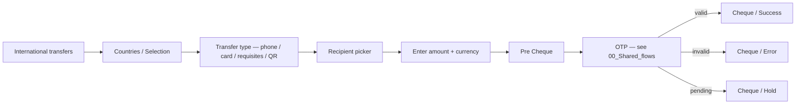
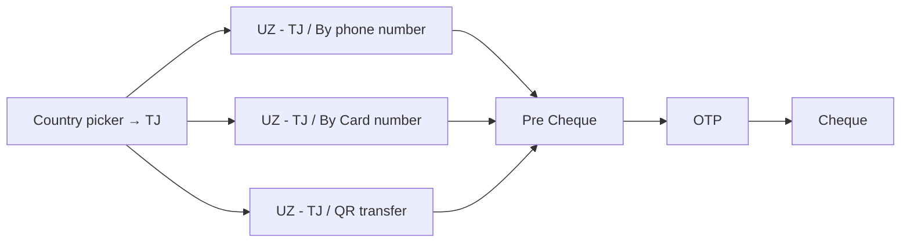
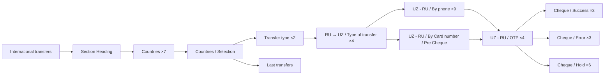
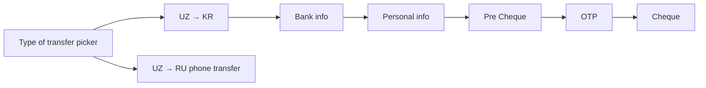
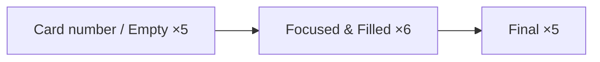
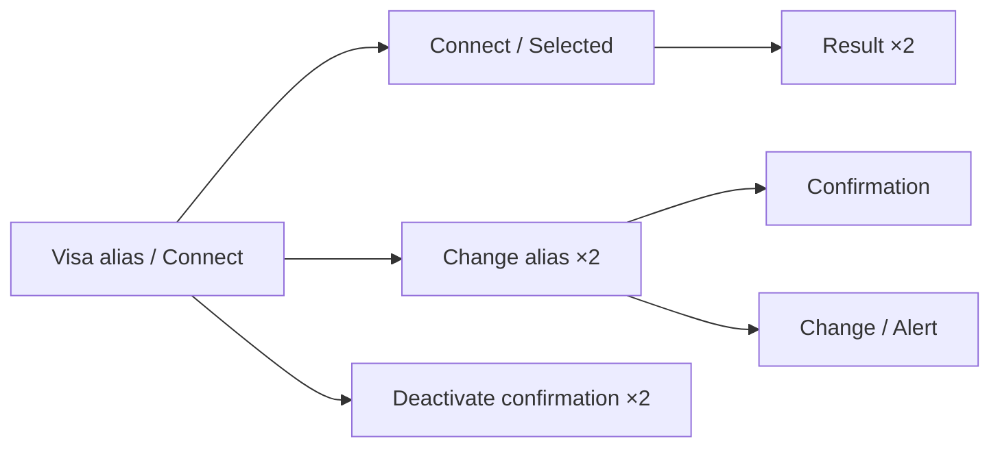

# 05 · Move Money — Cross-border · Pillar E

The largest pillar by frame count and the heart of Unired's cross-border
remittance product. Five corridors covered: UZ ↔ KG / TJ / CN / RU / KR.

| Section | Page | Node ID | Frames | Status |
|---|---|---|---|---|
| Light / P2P (all corridors UZ↔KG/TJ/CN/RU) | Final Design | `15680:108656` | **175** | Final — largest section in file |
| P2P Russia ↔ Uzbekistan (dedicated) | Final Design | `21328:122978` | 54 | Final |
| Wallet transfer all (UZ→RU + UZ→KR) | Final Design | `21328:122675` | 14 | Final |
| Light / Visa direct | Final Design | `19581:195976` | 16 | Final |
| Light / Visa alias | Final Design | `19534:113178` | 16 | Final |

**Total: 275 Final frames — the densest pillar in the file.**

> **Audit hint:** treat `Light / P2P` (175) by **corridor**, not
> chronologically. Each corridor (UZ↔KG, UZ↔TJ, UZ↔CN, UZ↔RU) has its own
> by-phone / by-card / QR / pre-cheque + state-set sub-flow. Audit each
> corridor as its own mini-section.

---

## E.0 · Universal cross-border skeleton



Every corridor instantiates this skeleton with its own phone-format,
card-format, and recipient-resolution rules.

*Reuses OTP template — see [00_Shared_flows § OTP](./00_Shared_flows.md#otp).*
*Reuses cheque template — see [00_Shared_flows § Cheque](./00_Shared_flows.md#cheque).*

---

## E.1 · UZ ↔ KG (Kyrgyzstan)

```mermaid
flowchart LR
    Entry[Country picker → KG] --> Type{By phone | By card | QR}
    Type -->|phone| Phone[UZ - KG / By phone]
    Type -->|card| Card[UZ - KG / By Card number]
    Type -->|qr| QR[UZ - KG / QR transfer]
    Phone --> Pre[Pre Cheque]
    Card --> Pre
    QR --> Pre
    Pre --> OTP[OTP]
    OTP --> Done[Cheque]
```

Inside `Light / P2P` (`15680:108656`). Multiple frames named
`P2P / UZ - KG / By Card number` exist — cross-reference by **ID** not name.
Full state-set per corridor: empty / focused / filled / error / pre-cheque /
OTP / success.

---

## E.2 · UZ ↔ TJ (Tajikistan)

Same flow shape as KG. By phone · By card · QR · Pre Cheque. Inside
`Light / P2P`.



Cross-referenced from the PTP Wallet presentation block (5 frames pinned).

---

## E.3 · UZ ↔ CN (China)

The thinnest corridor. Inside `Light / P2P`.

| State | Frame |
|---|---|
| Empty | P2P / UZ - CN / Empty |
| Focused | P2P / UZ - CN / Focused |

Newer / less developed than KG and TJ. Likely a recent addition. May lack
full state coverage (no explicit pre-cheque / OTP / success documented in
audit).

---

## E.4 · P2P Russia ↔ Uzbekistan (dedicated)

Source: `P2P Russia ↔ Uzbekistan` (`21328:122978`). 54 frames — the most
state-rich corridor on the file. Dedicated section because RU↔UZ is the
highest-volume corridor.



### Cluster — RU↔UZ

| Group | Count |
|---|---|
| Section Heading | 1 |
| International transfers / Countries | 7 |
| Countries / Selection | 1 |
| Countries / Transfer type | 2 |
| RU → UZ transfer / Type of transfer | 4 |
| RU - UZ / Cheque / Success | 3 |
| RU - UZ / Cheque / Error | 3 |
| RU - UZ / Cheque / **Hold** | **6** (largest sub-set on file) |
| UZ - RU / OTP | 4 |
| UZ → Russia (base flow) | 10 |
| UZ - RU / By phone number | 9 |
| UZ - RU / By Card number / Pre Cheque | 2 |
| International transfers / Last transfers | 1 |

The 6-frame `Hold` cheque sub-set is unique to this corridor — the RU
remittance pipeline has the most ambiguous "pending" status surface and
needs the richest UI for it.

---

## E.5 · UZ → KR (Korea) — via Wallet transfer all

Source: `Wallet transfer all (e.g. GME)` (`21328:122675`). 14 frames.



Korea-specific differences:
- Transfer type pickers
- **Bank info** screen — sender picks recipient's KR bank from `Korean
  Bank Logos` (54-variant set)
- **Personal info** — KR-specific KYC fields (resident registration number,
  recipient address)
- Pre-cheque before OTP

This section also hosts the canonical `UZ → RU phone transfer` panel — the
"GME" naming hints at integration with a remittance partner.

---

## E.6 · Visa Direct — card-number entry

Source: `Light / Visa direct` (`19581:195976`). 16 frames.



| Group | Count |
|---|---|
| Visa Direct / Card number (base) | 5 |
| Card number / Focused & Filled | 6 |
| Visa Direct (final) | 5 |

Visa Direct ships a card-number-entry experience tailored to push-to-card
remittance. State-rich form-focus progression — every focus / filled
combination gets its own frame.

---

## E.7 · Visa Alias — connect / change / deactivate

Source: `Light / Visa alias` (`19534:113178`). 16 frames.



| Group | Count |
|---|---|
| Visa alias / Connect | 1 |
| Connect / Selected | 1 |
| Change alias | 2 |
| Deactivate confirmation | 2 |
| Change | 1 |
| Result | 2 |
| Confirmation | 1 |
| Change / Alert | 1 |
| Section heading description | 3 |
| Button Group | 1 |
| Light / My Cards (cross-ref) | 1 |

Visa Alias = bind a phone number to a Visa card number for inbound
remittance (recipient need not share card number — just alias).

---

## Open questions (from global plan §4)

1. **P2P 175-frame audit (§Risk register)** — the section is too dense to
   audit in one pass. Break by corridor; treat each corridor as its own
   phase.
2. **UZ ↔ CN coverage gap** — only Empty + Focused frames documented.
   Decide: full state coverage or remove the entry-point.

---

## Reusable components

From `Unired_library_audit.md`:

- **Country Flags** (96) — country selector picker on every corridor
- **Transfer Flags** (13)
- **Transfer 3D icons** (9)
- **Transfer App logos** (5)
- **Payment System Logos** (26) — Visa / MIR / Mastercard
- **Korean Bank Logos** (54) — UZ→KR bank info
- **Russian Bank Logos** (21) + **Russian Bank Icons** (154) — UZ↔RU
- **Card Input** (9) — Visa Direct card-number entry
- **Section Heading** + **Section heading description** (3) — RU↔UZ
- **Stamp** (6) — cheque hold/success/error overlays
- **Loader** (8) — OTP / payment loading
- **Bottom Menu** — see [00_Shared_flows § Bottom menu](./00_Shared_flows.md#bottom-menu)
