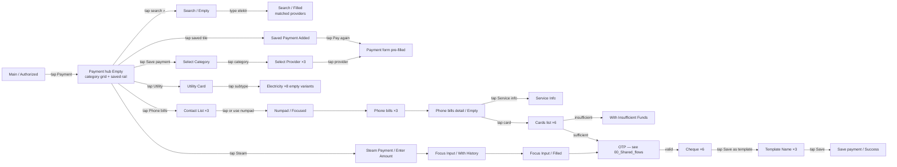
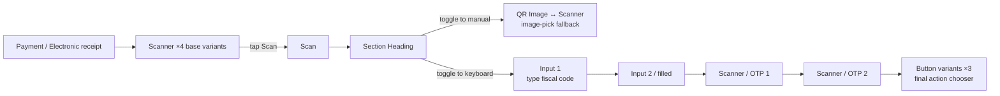
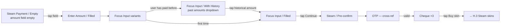
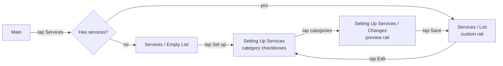
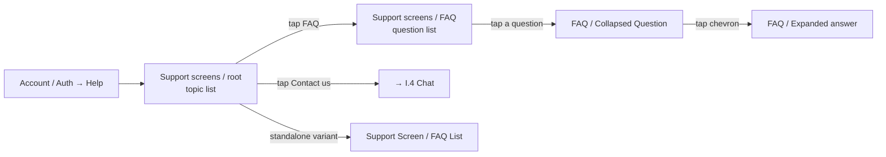
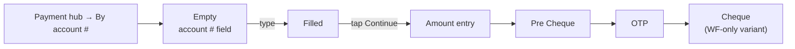

# 06 · Pay Services · Pillar F

Bills, providers, QR, e-receipts, Steam, services hub, card-order
applications. The most operationally varied pillar — every service category
has its own provider chooser, form, and cheque variant.

| Section | Page | Node ID | Frames | Status |
|---|---|---|---|---|
| Payment | Final Design | `13124:97996` | 67 | Final |
| Light / QR payment | Final Design | `17155:118561` | 48 | Final |
| ELQR | Final Design | `17155:122610` | 14 | Final |
| Steam | Final Design | `17096:93688` | 21 | Final |
| Light / Services screens | Final Design | `9917:75406` | 4 | Final |
| Light / Application menus | Final Design | `17155:121025` | 30 | Final |
| Light / My home | Working files | `19743:105449` | 19 | **WIP — promote-ready** |
| Light / Support screens | Working files | `10358:85629` | 3 | **WIP** |
| Light / Payment / Payment to account number | Working files | standalone | 14 | **WIP** |

**Total: 184 Final + 36 WIP = 220 frames.**

---

## F.1 · Payment hub — utility, phone bills, Steam, saved templates

The heaviest payments section. 67 frames cover every payment category.

**Entry:** Bottom menu → "Payment" tab, OR Main → "Payment" tile.
**Exit:** Cheque (success / error) → returns to Main / Payment hub.
**Goal:** pay any service (utility, phone, electricity, Steam, etc.) from
a Unired card, with optional template-saving for recurring payments.

### Step ledger — phone-bill payment (representative)

| # | User action | Screen | Frame |
|---|---|---|---|
| 1 | Tap Payment on bottom menu | Hub Empty | Payment / Empty |
| 2 | Tap Phone bills tile | Contact list | Payment / Phone bills / Contact List (1) |
| 3a | Tap a contact | Form pre-filled | Payment / Phone bills (1) |
| 3b | Tap numpad icon | Numpad up | Payment / Phone bills / Numpad/Focused |
| 4 | Type phone number | Filled | Payment / Phone bills (2..3) |
| 5 | Tap Continue | Phone-bill detail | Payment / Phone bills detail / Empty |
| 6 | Tap Service info link | Service info modal | Payment / Phone bills / Service Info |
| 7 | Tap Pay | Cards list | Payment / Phone bills / Cards list (1..6) |
| 8a | (insufficient funds card) | Insufficient | Payment / With Insufficient Funds |
| 8b | (sufficient) Tap card | Confirm | (variant) |
| 9 | Tap Confirm | OTP | (cross-ref) |
| 10 | Type code | OTP Filled | (cross-ref) |
| 11 | (server: ok) | Cheque ×6 | Payment / Cheque |
| 12a | Tap Save as template | Template Name | Payment / Template Name (1) |
| 12b | Type name | Template named | Payment / Template Name (2) |
| 12c | Tap Save | Save success | Save payment / Success |
| 13 | Tap Done | → Hub with new template visible | — |

### Cluster — Payment counts

| Group | Count | Notes |
|---|---|---|
| Empty / Search | 4 | Empty (×2) · Search/Empty · Search/Filled |
| Saved Payments | ~10 | Saved Payment Added (×4), Saved List, Action Buttons, Delete button |
| Save-payment setup | 4 | Select Category · Select Provider (×3) |
| Utility / Electricity | ~8 | Utility Card · Electricity (×8 empty variants) |
| Phone bills | ~12 | Contact List (×3), Numpad/Focused, Phone bills (×3), Template Name (×3) |
| Phone bills detail | ~12 | Empty · Empty Rus · Service Info · Cards list (×6), With Insufficient Funds |
| Steam Payment (in-Payment) | ~6 | Steam Payment, Enter Amount/Filled, Focus Input variants |
| Cheque + Save success | ~7 | Cheque (×6) + Save payment / Success |
| OTP fallback | 1 | Cross-ref Auth / OTP / Empty State |

The **Save payments** sub-flow is unique to this pillar: after a payment
completes, the user can save the recipient + amount as a recurring
template, then re-fire it from the Saved list with one tap.

*Reuses OTP template — see [00_Shared_flows § OTP](./00_Shared_flows.md#otp).*
*Reuses cheque template — see [00_Shared_flows § Cheque](./00_Shared_flows.md#cheque).*

---

## F.2 · QR payment — scan & pay

**Entry:** Bottom menu → "QR" tab, OR Main → "QR" tile, OR Payment hub
→ "QR" CTA.
**Exit:** Cheque + receipt → Main / Monitoring.
**Goal:** scan a merchant or peer QR code and complete the resulting
payment, including tip flow for hospitality.

```mermaid
flowchart LR
    Tap[Bottom menu tap QR] --> Scan[Scan / camera-active]
    Scan -->|external link QR| Ext[Scan - External link<br/>Open in browser?]
    Scan -->|unsupported| Unrec[Scan - unrecognizable QR]
    Scan -->|valid Unired QR| Q[QR ×2 entry]
    Q --> S[Scanner ×6 base variants<br/>parsed merchant info]
    S --> Loading[Scanner / Payment loading<br/>fetching merchant]
    Loading --> MyC[Scanner / My cards<br/>card carousel]
    MyC -->|insufficient| Insuf[My cards / Insufficient balance]
    MyC -->|sufficient + hospitality| Loc[Scanner / Location<br/>geofenced merchant]
    Loc --> Tips[Scanner / Tips / Payment]
    Tips -->|tap Add tip| Focus[Tips / Focused]
    Focus --> Filled[Tips / Filled ×2]
    Filled -->|tap Rate| Rate[Tips / Rate]
    Rate --> Rated[Tips / Rated]
    Rated -->|tap Comment| Comment[Tips / Comment]
    Comment --> Pay1[Scanner / Filled / Payment ×2]
    MyC -->|sufficient + non-hospitality| Pay1
    Pay1 -->|tap Pay| OTP[Scanner / OTP ×4]
    OTP -->|valid| Receipt[Scanner / Receipt ×3]
    Receipt -->|tap row| Det[Receipt / Details]
    OTP -->|valid alt| Final[QR Payment final ×8]
```

### Step ledger — hospitality QR with tip

| # | User action | Screen | Frame |
|---|---|---|---|
| 1 | Tap QR tab | Camera-active | Scan |
| 2 | Point at merchant QR | (parser fires) | Scan (variant) |
| 3 | (valid) | QR parsed | QR (1..2) |
| 4 | (auto-advance) | Scanner with merchant | Scanner (1..6) |
| 5 | (loading merchant detail) | Loading overlay | Scanner / Payment loading |
| 6 | (load done) | Card picker | Scanner / My cards |
| 7 | Tap card | Location confirmed | Scanner / Location |
| 8 | Tap Add tip | Tips entry | Scanner / Tips / Payment |
| 9 | Tap field | Focused | Tips / Focused |
| 10 | Type tip amount | Filled | Tips / Filled (1..2) |
| 11 | Tap Rate experience | Rate prompt | Tips / Rate |
| 12 | Tap stars | Rated | Tips / Rated |
| 13 | Tap Add comment | Comment field | Tips / Comment |
| 14 | Type comment | (variant) | (variant) |
| 15 | Tap Pay | Final payment screen | Scanner / Filled / Payment (1..2) |
| 16 | (auto on submit) | OTP | Scanner / OTP (1..4) |
| 17 | (server: ok) | Receipt | Scanner / Receipt (1..3) |
| 18 | Tap row | Receipt details | Receipt → details |
| 19 | (alt) Tap Done | Final state | QR Payment (1..8 finals) |

### Notable sub-flows

- **Tips flow** — Focus → Filled → Rate → Rated → Comment. Likely for
  hospitality / restaurant QR payments. Optional — non-hospitality QRs
  skip straight to OTP.
- **Receipt details (×3 + details)** — receipt with line-item drill-down.
- **OTP fallback (×4)** — embedded inside QR section (not just cross-ref).
- **Variants frame** — component organizer, not a flow screen.

---

## F.3 · ELQR — electronic-receipt QR

**Entry:** Payment hub → "Electronic receipt" tile, OR direct deep-link
from a fiscal receipt.
**Exit:** Receipt confirmation modal.
**Goal:** scan a tax-fiscal receipt's QR and verify / declare it via the
Unired wallet.

Source: `ELQR` (`17155:122610`). 14 frames.

| Group | Count |
|---|---|
| Scanner | 4 |
| Scan | 1 |
| Section Heading | 1 |
| QR Image ↔ Scanner | 1 |
| Input ↔ Input | 2 |
| Scanner / OTP | 2 |
| Button ↔ variants | 3 |

The "↔" naming pattern in the audit suggests reciprocal toggle states (QR
view ↔ scanner view, input mode A ↔ input mode B).

---

## F.4 · Steam payment

**Entry:** Payment hub → "Steam" tile, OR Main → "Steam" shortcut.
**Exit:** Cheque + Steam wallet credit confirmation.
**Goal:** top up Steam wallet from a Unired card.

Source: `Steam` (`17096:93688`). 21 frames.

### Step ledger

| # | User action | Screen | Frame |
|---|---|---|---|
| 1 | Tap Steam tile | Steam empty | Steam Payment (1..9 base variants) |
| 2 | Tap amount field | Focus Input | Steam Payment / Focus Input |
| 3a | (returning user) | History dropdown shown | Steam Payment / Focus Input / With History |
| 3b | (first time) | Plain numpad | Steam Payment / Focus Input |
| 4 | Type / pick amount | Filled | Steam Payment / Focus Input / Filled |
| 5 | Tap Continue | Pre-confirm | Steam Payment / Amount |
| 6 | (auto on submit) | OTP | (cross-ref) |
| 7 | (server: ok) | Cheque ×3 | Cheque (1..3) |

| Group | Count |
|---|---|
| Steam Payment (base variants) | 9 |
| Cheque | 3 |
| Steam Payment / Enter Amount / Filled | 1 |
| Focus Input · With History · Filled | 3 |
| Steam Payment / Amount | 1 |
| Electricity / Empty (cross-ref) | 1 |
| Auth / OTP / Empty State (cross-ref) | 1 |
| Misc (PIC, Frame 13) | 2 |

**Steam skins (Pillar H)** is referenced indirectly — when the user buys
a skin, the catalog from
[08_Lifestyle_Commerce.md § H.3](./08_Lifestyle_Commerce.md#h3--steam-skins-out-of-scope)
is the content layer.

---

## F.5 · Services hub — customizable shortcut rail

**Entry:** Main → "Services" tile, OR Account → "Services" CTA.
**Exit:** Returns to Main with rail re-ordered, or to specific service.
**Goal:** customize the home-screen shortcut rail to expose
frequently-used payment categories.

Source: `Light / Services screens` (`9917:75406`). 4 frames.

| ID | Frame | Size |
|---|---|---|
| `9917:75407` | Light / Services / List | 1184h |
| `9917:75430` | Light / Services / Empty List | 812h |
| `9917:75440` | Light / Services / Setting Up Services | 1174h |
| `9917:75466` | Light / Services / Setting Up Services / Changes | 1254h |

A customizable rail of payment shortcuts surfaced on Main. The tall
heights (1174 / 1254 / 1184) are scrollable-content captures, not phone-
rendered viewports.

---

## F.6 · Application menus — card order + address

**Entry:** Account → "Order new card" CTA, OR Main → "+" → "Order
physical card", OR My Cards → "+ Card".
**Exit:** "My applications" with the new application visible.
**Goal:** order a physical card with a delivery address (map-pin drop).

Source: `Light / Application menus` (`17155:121025`). 30 frames.

```mermaid
flowchart LR
    Acct[Account / My Cards] -->|tap Order card| Order1[Order card / step 1]
    Order1 --> Order2[step 2]
    Order2 --> Order3[step 3]
    Order3 --> Order4[step 4]
    Order4 --> Order5[step 5]
    Order5 --> Order6[step 6]
    Order6 --> Order7[step 7]
    Order7 --> Order8[step 8]
    Order8 --> Order9[step 9]
    Order9 -->|tap Custom number| Custom[Custom card number ×11<br/>vanity-number form]
    Order9 -->|tap Pick address| Apps[Applications]
    Custom --> Apps
    Apps --> Addr1[Address / step 1]
    Addr1 --> Addr2[step 2]
    Addr2 --> Addr3[step 3]
    Addr3 -->|tap Pick on map| Map[Address / Map<br/>pin-drop interaction]
    Map -->|tap Confirm location| Filled[Address / Filled]
    Filled -->|tap Submit| MyApps[My applications]
    Custom -->|UCoin pickable| UCoinX[Add UCoin Type / Loading ×2<br/>cross-ref Pillar B]
```

### Step ledger — card order with delivery

| # | User action | Screen | Frame |
|---|---|---|---|
| 1 | Tap Order card | Order card step 1 | Light / Application menus / Order card (1) |
| 2..9 | Step through card-config (type, currency, design, name on card, etc.) | Order card 2..9 | (variants) |
| 10 | Tap Pick delivery address | Applications | Light / Application menus / Applications |
| 11 | Tap Address | Address step 1 | Address (1) |
| 12 | Type street / city | Address step 2 | Address (2) |
| 13 | Tap Pick on map | Map view with draggable pin | Address / Map |
| 14 | Drag pin / tap on map | Pin moved | (variant) |
| 15 | Tap Confirm location | Filled with formatted address | Address / Filled |
| 16 | Tap Submit application | My applications list | My applications |
| 17 | Tap row | Application detail | (cross-ref) |

| Group | Count |
|---|---|
| Order card (step variants) | 9 |
| Application menu / Custom card number | 11 |
| Application menu / Applications / Address | 3 |
| Address / Map | 1 |
| Address / Filled | 1 |
| UCoin Type/Loading (cross-ref) | 2 |
| My applications | 1 |
| Main / Authorized / Cards Added (cross-ref) | 2 |
| Misc (Frame 277134019, IMG, Heading decorator) | ~3 |

The map sub-flow (Address / Map) is unique to this pillar — pin-drop on a
map for delivery address. Cross-references the Cards-Added Main view from
[09_Information_Engagement.md § I.1](./09_Information_Engagement.md#i1--main--home).

*Cross-pillar:* this section also feeds card-add from the Cards pillar
(see [02_Cards.md § B.4](./02_Cards.md#b4--ucoin-loyalty-card)).

---

## WIP / Working files

### F.7 · My home (WIP)

Source: `Light / My home` (`19743:105449`). 19 frames. **Unique to
Working files** — group services by household.

**Entry:** Main → "My home" tile (once promoted), OR Services hub → "My
home".
**Exit:** Returns to Main with named-home context active.
**Goal:** group household services (electricity + gas + water + internet
+ phones) under one named home so they can be paid in batch or tracked
together.

```mermaid
flowchart LR
    Main[Main] -->|tap My home| Empty[My home / Empty<br/>Add your first home]
    Empty -->|tap +| Add0[Add home / Empty]
    Add0 -->|tap field| AddF[Add home / Focused<br/>name field active]
    AddF -->|type name| AddFilled[Filled]
    AddFilled -->|tap Save| Sel0[Services selection ×2<br/>service-type chooser]
    Sel0 -->|tap Mobile| Mob0[Services selection / Mobil aloqa / To'lov<br/>configure mobile bill]
    Mob0 -->|fill phone| Mob1[Mobil aloqa / To'lov / Filled]
    Mob1 -->|tap Save| Add2[Add services]
    Add2 -->|tap From saved templates| Saved[Add services / Saved payments]
    Saved -->|tap Add| AddS[Add from saved]
    Add2 -->|tap Home settings| HS[Add services / Home settings]
    HS -->|tap Done| Inner[Inner / Services list ×2<br/>per-home services view]
    Inner -->|tap a service| Pay[Inner / Services list / Payment<br/>standard payment form]
    Pay -->|tap Pay| ChQ[Inner / Payment / Payment cheque]
    ChQ --> Success[Inner / Services list / Success info]
    Success -->|back| Inner
    Inner -->|tap Rename| Rename[Change home name / Empty → Focused]
    Inner -->|tap Delete| Del[Delete home / confirmation]
    Del -->|tap Confirm| Empty
```

### Step ledger — first-time home setup

| # | User action | Screen | Frame |
|---|---|---|---|
| 1 | Tap My home tile on Main | Empty | My home / Empty |
| 2 | Tap + Add home | Add home form | My home / Add home |
| 3 | Tap name field | Focused | My home / Add home / Focused |
| 4 | Type Дача / Home | Filled | (variant) |
| 5 | Tap Save | Services selection | My home / Services selection (1..2) |
| 6 | Tap Mobile | Mobile-bill detail | My home / Services selection / Mobil aloqa / To'lov |
| 7 | Type phone | Filled | My home / Services selection / Mobil aloqa / To'lov / Filled |
| 8 | Tap Save | Add services hub | My home / Add services |
| 9a | Tap From saved templates | Saved-payments | My home / Add services / Saved payments |
| 9b | Tap Add | Add-from-saved confirmation | My home / Add services / Saved payments / Add from saved |
| 10 | Tap Home settings | Home settings | My home / Add services / Home settings |
| 11 | Tap Done | Inner / Services list | My home / Inner / Services list (1..2) |
| 12 | Tap Mobile service | Payment form | My home / Inner / Services list / Payment |
| 13 | Tap Pay | Payment cheque | My home / Inner / Services list / Payment / Payment cheque |
| 14 | (server: ok) | Success info | My home / Inner / Services list / Success info |
| 15 | (later) Tap Delete home | Delete confirmation | My home / Delete home |

**Promote-ready** — covers full empty → add → configure → payment → cheque
arc (global plan §5 Step 1).

### F.8 · Support screens (WIP)

Source: `Light / Support screens` (`10358:85629`). 3 frames + 2
standalones. Effectively unique to Working files.

**Entry:** Account → "Help & Support", OR Auth → "Need help?", OR Main →
help icon.
**Exit:** Returns to Account / Main, or escalates to chat (cross-ref I.4).

| Frame |
|---|
| Support screens (entry) |
| Support screens / FAQ |
| Support screens / FAQ / Collapsed Question |
| Standalone: `Light / Support Screen` |
| Standalone: `Light / Support Screen / FAQ List` |

Promote candidate.

### F.9 · Payment to account number (WIP)

14 standalone frames named `Light / Payment / Payment to account number`
(states + cheque). On Working files only. Likely overlaps with the Bank
account pillar's pay-by-requisites flow (see
[03_Bank_Account.md § C.2](./03_Bank_Account.md#c2--pay-by-requisites-cross-pillar-dispatch)) —
**reconcile before promoting** (global plan §3 feature matrix).

---

## Open questions (from global plan §4)

1. **Save payments + Templates** — are saved-payment templates separately
   tracked from Phone-bill template names? Two surfaces both named
   "Template" inside Payment — verify single canonical model.
2. **Service illustrations adoption (§4.6)** — 18 current + 20 deprecated
   illustrations both in library; some Payment categories use the
   deprecated set. Audit and prune (global plan §5 Step 2).
3. **Payment-to-account-number reconciliation** — is the WIP standalone
   redundant with Bank account's pay-by-requisites? Pick one.

---

## Reusable components

From `Unired_library_audit.md`:

- **Service illustrations** (18) + **Service illustrations - old** (20) — pick one set
- **Category Illustration** (30) — payment category tiles
- **Communication providers** (9) — mobile-carrier logos
- **Payment Types** (41) — heavy provider tile set
- **Payment Service Icons** (6)
- **Allowed cards** (2)
- **Card Input** (9) — funding-card entry
- **Loader** (8) — payment loading
- **Stamp** (6) — cheque overlays
- **Modal - status** — payment success / insufficient funds modals
- **Saved** (4) — saved-payment indicator badge
- **Section Heading** — flow chrome
- **Stars container** (6) — QR tip-flow rating
- **Action Buttons Section** — final cheque CTA rail
- **Bottom Menu** — see [00_Shared_flows § Bottom menu](./00_Shared_flows.md#bottom-menu)
- **Image Tab** (3) — QR / image-mode toggle in ELQR
- **Tab Item** (2) — ELQR mode toggle
