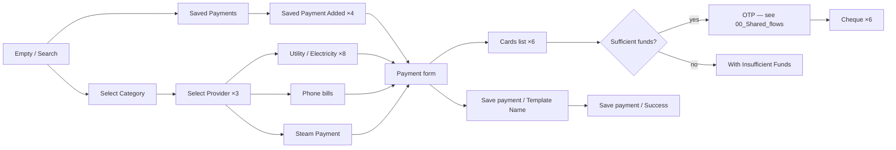
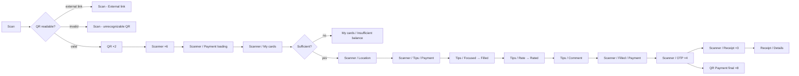
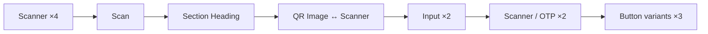
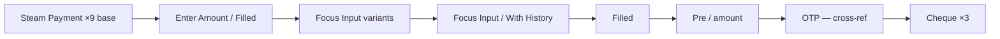
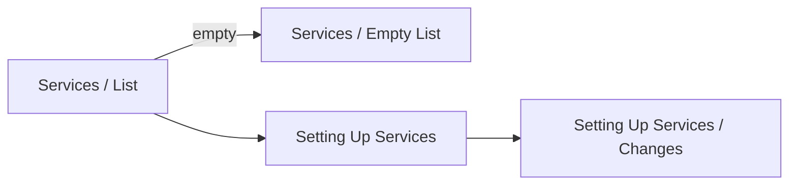
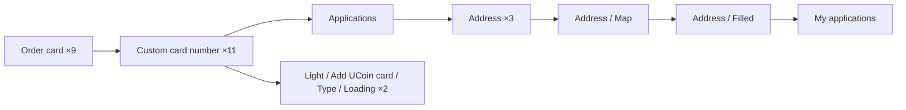
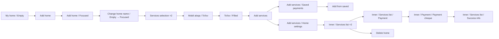

# 06 · Pay Services · Pillar F

Bills, providers, QR, e-receipts, Steam, services hub, card-order
applications. The most operationally varied pillar — every service category
has its own provider chooser, form, and cheque variant.

| Section | Page | Node ID | Frames | Status |
|---|---|---|---|---|
| Payment | Final Design | `13124:97996` | 67 | Final |
| Light / QR payment | Final Design | `17155:118561` | 48 | Final |
| ELQR | Final Design | `17155:122610` | 14 | Final |
| Steam | Final Design | `17096:93688` | 21 | Final |
| Light / Services screens | Final Design | `9917:75406` | 4 | Final |
| Light / Application menus | Final Design | `17155:121025` | 30 | Final |
| Light / My home | Working files | `19743:105449` | 19 | **WIP — promote-ready** |
| Light / Support screens | Working files | `10358:85629` | 3 | **WIP** |
| Light / Payment / Payment to account number | Working files | standalone | 14 | **WIP** |

**Total: 184 Final + 36 WIP = 220 frames.**

---

## F.1 · Payment hub — utility, phone bills, Steam, saved templates

The heaviest payments section. 67 frames cover every payment category.

Source: `Payment` (`13124:97996`).

### Cluster

| Group | Count | Notes |
|---|---|---|
| Empty / Search | 4 | Empty (×2) · Search/Empty · Search/Filled |
| Saved Payments | ~10 | Saved Payment Added (×4), Saved List, Action Buttons, Delete button |
| Save-payment setup | 4 | Select Category · Select Provider (×3) |
| Utility / Electricity | ~8 | Utility Card · Electricity (×8 empty variants) |
| Phone bills | ~12 | Contact List (×3), Numpad/Focused, Phone bills (×3), Template Name (×3) |
| Phone bills detail | ~12 | Empty · Empty Rus · Service Info · Cards list (×6), With Insufficient Funds |
| Steam Payment (in-Payment) | ~6 | Steam Payment, Enter Amount/Filled, Focus Input variants |
| Cheque + Save success | ~7 | Cheque (×6) + Save payment / Success |
| OTP fallback | 1 | Cross-ref Auth / OTP / Empty State |

The **Save payments** sub-flow is unique to this pillar: after a payment
completes, the user can save the recipient + amount as a recurring
template, then re-fire it from the Saved list with one tap.

*Reuses OTP template — see [00_Shared_flows § OTP](./00_Shared_flows.md#otp).*
*Reuses cheque template — see [00_Shared_flows § Cheque](./00_Shared_flows.md#cheque).*

---

## F.2 · QR payment — scan & pay

Source: `Light / QR payment` (`17155:118561`). 48 frames.

### Notable sub-flows

- **Tips flow** — Focus → Filled → Rate → Rated → Comment. Likely for
  hospitality / restaurant QR payments.
- **Receipt details (×3 + details)** — receipt with line-item drill-down.
- **OTP fallback (×4)** — embedded inside QR section (not just cross-ref).
- **Variants frame** — component organizer, not a flow screen.

---

## F.3 · ELQR — electronic-receipt QR

Electronic-receipt (e-fiscal) scanner. 14 frames at `17155:122610`.

| Group | Count |
|---|---|
| Scanner | 4 |
| Scan | 1 |
| Section Heading | 1 |
| QR Image ↔ Scanner | 1 |
| Input ↔ Input | 2 |
| Scanner / OTP | 2 |
| Button ↔ variants | 3 |

The "↔" naming pattern in the audit suggests reciprocal toggle states (QR
view ↔ scanner view, input mode A ↔ input mode B). 

---

## F.4 · Steam payment

Source: `Steam` (`17096:93688`). 21 frames.

| Group | Count |
|---|---|
| Steam Payment (base variants) | 9 |
| Cheque | 3 |
| Steam Payment / Enter Amount / Filled | 1 |
| Focus Input · With History · Filled | 3 |
| Steam Payment / Amount | 1 |
| Electricity / Empty (cross-ref) | 1 |
| Auth / OTP / Empty State (cross-ref) | 1 |
| Misc (PIC, Frame 13) | 2 |

**Steam skins (Pillar H)** is referenced indirectly — when the user buys
a skin, the catalog from
[08_Lifestyle_Commerce.md § H.3](./08_Lifestyle_Commerce.md#h3--steam-skins-out-of-scope)
is the content layer.

---

## F.5 · Services hub — customizable shortcut rail

Source: `Light / Services screens` (`9917:75406`). 4 frames.

| ID | Frame | Size |
|---|---|---|
| `9917:75407` | Light / Services / List | 1184h |
| `9917:75430` | Light / Services / Empty List | 812h |
| `9917:75440` | Light / Services / Setting Up Services | 1174h |
| `9917:75466` | Light / Services / Setting Up Services / Changes | 1254h |

A customizable rail of payment shortcuts surfaced on Main. The tall
heights (1174 / 1254 / 1184) are scrollable-content captures, not phone-
rendered viewports.

---

## F.6 · Application menus — card order + address

Source: `Light / Application menus` (`17155:121025`). 30 frames. Hosts the
**order-a-physical-card** flow + custom card-number application.

| Group | Count |
|---|---|
| Order card (step variants) | 9 |
| Application menu / Custom card number | 11 |
| Application menu / Applications / Address | 3 |
| Address / Map | 1 |
| Address / Filled | 1 |
| UCoin Type/Loading (cross-ref) | 2 |
| My applications | 1 |
| Main / Authorized / Cards Added (cross-ref) | 2 |
| Misc (Frame 277134019, IMG, Heading decorator) | ~3 |

The map sub-flow (Address / Map) is unique to this pillar — pin-drop on a
map for delivery address. Cross-references the Cards-Added Main view from
[09_Information_Engagement.md § I.1](./09_Information_Engagement.md#i1--main--home).

*Cross-pillar:* this section also feeds card-add from the Cards pillar
(see [02_Cards.md § B.4](./02_Cards.md#b4--ucoin-loyalty-card)).

---

## WIP / Working files

### F.7 · My home (WIP)

Source: `Light / My home` (`19743:105449`). 19 frames. **Unique to
Working files** — group services by household.

| Frame | Notes |
|---|---|
| My home / Empty | First-time entry |
| My home / Add home | Create-home form |
| My home / Add home / Focused | Field focus |
| My home / Change home name (Empty → Focused) | Rename |
| My home / Services selection (×2) | Pick services to associate |
| My home / Services selection / Mobil aloqa / To'lov | Mobile-bill detail |
| My home / Services selection / Mobil aloqa / To'lov / Filled | Form filled |
| My home / Add services / Saved payments | Pull from saved templates |
| My home / Add services / Saved payments / Add from saved | Confirm |
| My home / Add services / Home settings | Per-home settings |
| My home / Inner / Services list (×2) | Per-home services list |
| My home / Inner / Services list / Payment | Pay one of the services |
| My home / Inner / Services list / Payment / Payment cheque | Cheque |
| My home / Inner / Services list / Success info | Confirmation |
| My home / Delete home | Remove a home |

**Promote-ready** — covers full empty → add → configure → payment → cheque
arc (global plan §5 Step 1).

### F.8 · Support screens (WIP)

Source: `Light / Support screens` (`10358:85629`). 3 frames + 2
standalones. Effectively unique to Working files.

| Frame |
|---|
| Support screens (entry) |
| Support screens / FAQ |
| Support screens / FAQ / Collapsed Question |

Plus standalone `Light / Support Screen` (×1) and `Light / Support Screen
/ FAQ List` (×1) on the same page. Promote candidate.

### F.9 · Payment to account number (WIP)

14 standalone frames named `Light / Payment / Payment to account number`
(states + cheque). On Working files only. Likely overlaps with the Bank
account pillar's pay-by-requisites flow (see
[03_Bank_Account.md § C.2](./03_Bank_Account.md#c2--cross-pillar-links)) —
**reconcile before promoting** (global plan §3 feature matrix).

---

## Open questions (from global plan §4)

1. **Save payments + Templates** — are saved-payment templates separately
   tracked from Phone-bill template names? Two surfaces both named
   "Template" inside Payment — verify single canonical model.
2. **Service illustrations adoption** — 18 current + 20 deprecated
   illustrations both in library; some Payment categories use the
   deprecated set. Audit and prune (global plan §4.6 / §5 Step 2).
3. **Payment-to-account-number reconciliation** — is the WIP standalone
   redundant with Bank account's pay-by-requisites? Pick one.

---

## Reusable components

From `Unired_library_audit.md`:

- **Service illustrations** (18) + **Service illustrations - old** (20) — pick one set
- **Category Illustration** (30) — payment category tiles
- **Communication providers** (9) — mobile-carrier logos
- **Payment Types** (41) — heavy provider tile set
- **Payment Service Icons** (6)
- **Allowed cards** (2)
- **Card Input** (9) — funding-card entry
- **Loader** (8) — payment loading
- **Stamp** (6) — cheque overlays
- **Modal - status** — payment success / insufficient funds modals
- **Saved** (4) — saved-payment indicator badge
- **Section Heading** — flow chrome
- **Bottom Menu** — see [00_Shared_flows § Bottom menu](./00_Shared_flows.md#bottom-menu)
