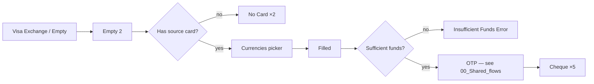
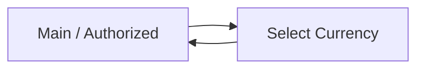

# 07 · Currency & FX · Pillar G

In-app currency conversion (Visa exchange) and the currency selector on
Main. Smallest pillar by frame count — narrow scope, single end-to-end
flow.

| Section | Page | Node ID | Frames | Status |
|---|---|---|---|---|
| Light / Visa exchange | Final Design | `13255:136716` | 13 | Final |
| Light / Main / Authorized User / Select Currency | Final Design | (in Main) | 1 | Final — selector only |

**Total: 14 Final frames.**

---

## G.1 · Visa exchange — currency conversion

Source: `Light / Visa exchange` (`13255:136716`). 13 frames.

### Cluster

| Group | Count | Notes |
|---|---|---|
| Visa Exchange / Empty | 2 | Resting state, no rate fetched |
| Insufficient Funds Error | 1 | Source card balance too low |
| No Card | 2 | User has no Visa card to exchange from |
| Currencies | 1 | Currency-pair picker |
| Filled | 1 | Form completed, ready to submit |
| Cheque | 5 | Confirmation cheque variants |
| Auth / OTP / Empty State (cross-ref) | 1 | OTP fallback |

The **Insufficient Funds Error** state is keyed differently from Payment's
identically-named state — the Visa-exchange one shows the FX rate before
flagging the gap, so the user can adjust amount.

*Reuses OTP template — see [00_Shared_flows § OTP](./00_Shared_flows.md#otp).*
*Reuses cheque template — see [00_Shared_flows § Cheque](./00_Shared_flows.md#cheque).*

---

## G.2 · Currency selector on Main

A single frame inside `Light / Main`: `Light / Main / Authorized User /
Select Currency` (`10031:77293`). Switches the displayed currency on the
home screen — does **not** trigger a real conversion, just a UI preference.

Cross-reference to [09_Information_Engagement.md § I.1](./09_Information_Engagement.md#i1--main--home).

---

## Open questions

No pillar-specific open questions in the global plan. The thinness of this
pillar (13 frames) reflects FX being a niche use-case in the Unired product
mix; cross-border *transfers* are far heavier (see Pillar E).

---

## Reusable components

From `Unired_library_audit.md`:

- **Country Flags** (96) — currency-flag icons
- **Payment System Logos** (26) — Visa indicator
- **Card Input** (9) — source card entry
- **Input** (35) — amount entry
- **Stamp** (6) — cheque overlay
- **Loader** (8)
- **Modal - status** — error / no-card modals
- **Bottom Menu** — see [00_Shared_flows § Bottom menu](./00_Shared_flows.md#bottom-menu)
