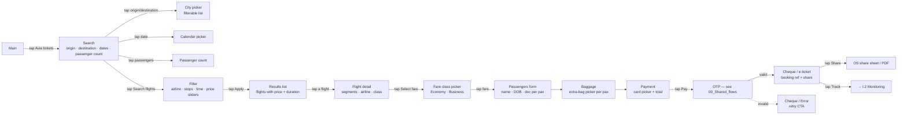
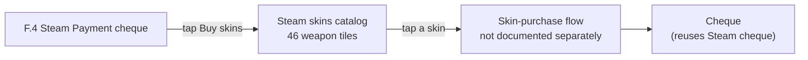

# 08 · Lifestyle & Commerce · Pillar H

Avia ticket booking + card-order applications + Steam skin catalog
(content-only). Two genuine app flows + one out-of-scope content module.

| Section | Page | Node ID | Frames | Status |
|---|---|---|---|---|
| Light / Avia tickets | Final Design | (per global plan) | 67 | Final — full flow |
| Light / Application menus | Final Design | `17155:121025` | 30 | Final — shared with Pillar F |
| Steam skins | Final Design | `17096:93687` | 46 | **Out of scope — content tiles** |

**Total: 97 Final frames (Avia + Application menus); 46 catalog frames excluded.**

> Pillar H overlaps with Pillar F (`Light / Application menus`). This file
> covers the **physical-card-order** angle of that section; the WIP /
> custom card aspects live in
> [06_Pay_Services.md § F.6](./06_Pay_Services.md#f6--application-menus-card-order--address).

---

## H.1 · Avia ticket booking — full flow

The most complete consumer-flow on the file. 67 frames cover search through
payment.

**Entry:** Main → "Avia tickets" tile, OR Services hub → "Travel".
**Exit:** Cheque / e-ticket → Monitoring / share PDF.
**Goal:** book a flight from origin to destination, picking dates,
passengers, baggage, fare class, then pay from a Unired card.

### Step ledger

| # | User action | Screen | Notes |
|---|---|---|---|
| 1 | Tap Avia tickets | Search root | Origin / dest empty |
| 2 | Tap origin field | City picker | Filterable list of airports |
| 3 | Type / pick origin | (variant) | Origin set |
| 4 | Tap destination | City picker | (variant) |
| 5 | Pick dates (one-way / round-trip) | Calendar picker | (variant) |
| 6 | Tap passenger count | Passenger config | Adults / children / infants |
| 7 | Tap Search flights | Loading → results | (variant) |
| 8 | Tap Filter | Filter modal | Airline / stops / price sliders |
| 9 | Tap Apply | Results filtered | (variant) |
| 10 | Tap a flight row | Flight detail | Segments breakdown |
| 11 | Tap Select fare | Fare class | Economy / Business |
| 12 | Tap fare | Passengers form | Per-pax fields |
| 13 | Fill names / DOBs / passport | Filled | (variant) |
| 14 | Tap Continue | Baggage | Per-pax extra-bag picker |
| 15 | Pick baggage | Filled | (variant) |
| 16 | Tap Continue | Payment | Card picker + total |
| 17 | Tap card | Card-picked | (variant) |
| 18 | Tap Pay | OTP | (cross-ref) |
| 19 | Type code | OTP filled | (cross-ref) |
| 20 | (server: ok) | Cheque / e-ticket | Booking ref visible |
| 21 | Tap Share | OS share / PDF | E-ticket exported |

**Note on per-frame depth:** the audit file names `Light / Avia tickets`
as a 67-frame section in the global plan §"Pillar H · Lifestyle &
commerce" but the detailed audit listing focuses primarily on the other 30
sections of Final Design. The 67-frame breakdown is documented at the
pillar / global level only — per-frame names are not enumerated in
`Unired_FinalDesign_LightVersion_audit.md`. The flow shape above is
inferred from the global plan's own description: *"search, filter,
baggage, passengers, payment"*.

For deep audit (per-frame name + ID), this section is the highest-value
candidate for a follow-up Phase 2 pass (global plan §"Caveat on audit
depth").

*Reuses OTP template — see [00_Shared_flows § OTP](./00_Shared_flows.md#otp).*
*Reuses cheque template — see [00_Shared_flows § Cheque](./00_Shared_flows.md#cheque).*

---

## H.2 · Card-order application (physical card)

**Entry:** Account → "Order new card" CTA, OR My Cards → "+" → "Order
physical card".
**Exit:** "My applications" with new application visible (status: pending).
**Goal:** order a physical Unired card to be delivered to a chosen
address (map pin-drop).

Source: `Light / Application menus` (`17155:121025`). 30 frames. **Shared
with Pillar F** — see [06_Pay_Services.md § F.6](./06_Pay_Services.md#f6--application-menus-card-order--address) for the full step ledger.

The **physical-card-order** is the lifestyle aspect:

```mermaid
flowchart LR
    Acct[Account] -->|tap Order card| Order[Order card 9-step form<br/>type · currency · design · name on card · etc.]
    Order -->|tap Custom number| Custom[Custom card number 11-state form<br/>vanity-number entry]
    Order -->|skip vanity number| Apps[Applications]
    Custom --> Apps
    Apps -->|tap Pick address| Addr[Address ×3 base states]
    Addr -->|tap Pick on map| Map[Address / Map<br/>pin-drop interaction]
    Map -->|drag pin / tap on map| MapMoved[(pin moved)]
    MapMoved -->|tap Confirm| Filled[Address / Filled<br/>formatted address]
    Filled -->|tap Submit application| Mine[My applications<br/>track status]
```

The map-pin-drop sub-flow is unique to this lifestyle pillar — used to
specify the physical delivery address for the new card.

---

## H.3 · Steam skins (out of scope)

Source: `Steam skins` (`17096:93687`). 46 frames.

A flat catalog of CS:GO weapon-skin tiles consumed by the Steam payment
integration. Tile examples (per audit):

> 3rd Commando Company KSK · AK-47 Elite Build · AK-47 Ice Coaled · AK-47
> Inheritance · AK-47 Olive Polycam · AWP Ice Coaled · Printstream · Broken
> Fang Gloves · Desert Eagle Mecha Industries / Serpent Strike / Trigger
> Discipline · Dragomir Sabre · …

**These are content tiles, not UI screens.** There's no flow through them
beyond pick-and-buy. Out of scope for any UI redesign work — treat as
embedded artwork.

The actual *purchase* flow lives in
[06_Pay_Services.md § F.4 Steam payment](./06_Pay_Services.md#f4--steam-payment).

---

## Open questions

No pillar-specific open questions in the global plan. The Avia booking
flow is the deepest unaudited surface in the file — a Phase 2 deep audit
of the 67 Avia frames would be the highest-leverage next investment for
this pillar.

---

## Reusable components

From `Unired_library_audit.md`:

- **Section Heading** + heading decorator — Avia search header / filters
- **Input** (35) — passenger names, search fields
- **Card Input** (9) — payment card entry
- **Status Icons** (17) — status indicators on flight results
- **Bank Card** (9) — payment card visualisation
- **Loader** (8) — search / payment loading
- **Stamp** (6) — cheque overlay
- **Modal - status** — confirmation modals
- **Action Buttons Section** — final CTA rail
- **Different Backgrounds** (12) — empty-state / hero backgrounds for
  Avia search
- **Tab Item** (2) — Avia tab toggles (one-way / round-trip)
- **Bottom Menu** — see [00_Shared_flows § Bottom menu](./00_Shared_flows.md#bottom-menu)
