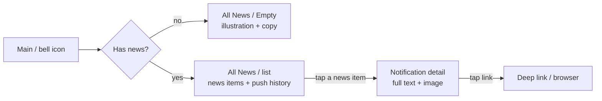
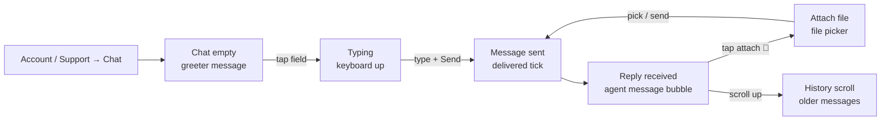
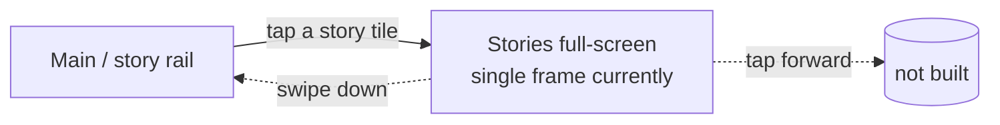

# 09 · Information & Engagement · Pillar I

Home (Main), transaction monitoring, news, in-app chat support, plus the
WIP support / FAQ, gamification, and stories surfaces. The connective
tissue between every other pillar — every flow starts from Main and most
end on Monitoring.

| Section | Page | Node ID | Frames | Status |
|---|---|---|---|---|
| Light / Main | Final Design | `9730:130203` | 18 | Final |
| Monitoring | Final Design | `19481:106128` | 16 | Final |
| Light / News & Push messages | Final Design | `13934:108807` | 3 | Final — thin |
| Chat | Final Design | `18921:95858` | 6 | Final |
| Stories (standalone) | Final Design | `21523:105023` | 1 | Thin |
| Notification img / Story mini-img (standalones) | Final Design | `21523:105075` / `21523:104977` | 2 | Asset |
| Light / Support screens | Working files | `10358:85629` | 3 + 2 | **WIP** |
| Gamification | Working files | `20917:117600` | 12 | **WIP — promote-ready** |
| Chat (duplicate) | Working files | `21534:131112` | 6 | Duplicate snapshot |

**Total: 46 Final + 23 WIP = 69 frames.**

---

## I.1 · Main / home

**Entry:** App resume (after auth), bottom-menu tap "Main", deep-link
return.
**Exit:** Tap any tile / chip → routes to that pillar's entry.
**Goal:** the product's home dashboard. Exposes balances, quick actions,
search, monitoring, stories, notifications, currency-display preference,
and per-pillar entry tiles.

```mermaid
flowchart LR
    AppOpen[App resume] -->|signed-out| G[Guest user — no cards]
    AppOpen -->|signed-in, no cards| Auth[Authorized — no cards]
    AppOpen -->|signed-in, has cards| A1[Authorized + Cards Added<br/>card carousel + balances]
    G -->|tap "Sign in"| AuthPillar[→ A.2 Phone sign-in]
    Auth -->|tap "Add card"| AddCard[→ B.2 Add card]
    A1 -->|notification arrives| Notif[+ Active Notification banner]
    A1 -->|tap currency chip| Sel[Select Currency<br/>see G.2]
    A1 -->|tap search ⌕| SearchE[Search / New<br/>empty]
    A1 -->|type| SearchL[Search / Last Search<br/>recent results]
    A1 -->|tap story tile| Stories[Stories — see § I.5]
    A1 -->|tap "Update available" banner| Update[Update Available<br/>app-store deep link]
    A1 -->|tap "Monitoring"| Mon[→ § I.2 Monitoring]
    A1 -->|tap "Cards"| Cards[→ Pillar B]
    A1 -->|tap "Payment"| Pay[→ Pillar F]
    A1 -->|tap "QR"| QR[→ F.2 QR payment]
    A1 -->|tap "Account"| Acc[→ Pillar A Account]
    A1 -->|tap "International transfers"| CB[→ Pillar E]
    A1 -->|tap "Local transfers"| Loc[→ Pillar D]
```

### Variants table

| Variant | Frame ID | Notes |
|---|---|---|
| Guest user (no cards) | `9730:130204` | Pre-auth state |
| Guest tall scroll | `9730:130411` | h=1444 — full-page capture |
| Authorized (no cards) | `9730:130248` | Logged in, no cards yet |
| Authorized + Cards Added | `10031:76934` | h=1402 — scrollable cards stack |
| Cards Added (variant 2) | `17752:130696` | (alt treatment) |
| Cards Added (variant 3) | `18765:99886` | (alt treatment) |
| + Active Notification | `9730:130306` | Banner / pill on top |
| Search / New | `9730:130364` | Empty search modal |
| Search / Last Search | `9730:130380` | Recent results |
| Search / Last Search (alt) | `9730:130397` | (alt treatment) |
| Select Currency | `10031:77293` | See [§ G.2](./07_Currency_FX.md#g2--currency-selector-on-main) |
| Account / Guest / Stories | `10573:77975` | Guest-mode story preview |
| Account / Guest / Stories (alt) | `10573:77992` | (alt) |
| Update Available | `19692:106767` | h=808 — in-app update banner |
| Monitoring | `17688:104472` | Monitoring entry-point |
| Monitoring (tall) | `17688:110396` | h=1246 |
| Misc | Frame 314537 / 314550 | (decorations / org frames) |

A standalone **Cards Added** capture exists at `11105:75477` (430×1821) —
treat as scrollable-content export, not phone viewport.

### Step ledger — first-time auth → first transfer

| # | User action | Screen | Outcome |
|---|---|---|---|
| 1 | Cold-start | Splash → Lang | Locale picked |
| 2 | (auth complete) | Main / Authorized (no cards) | Logged in, no cards |
| 3 | Tap "Add card" | → B.2 | Card added |
| 4 | (return) | Main / Cards Added | Card visible in stack |
| 5 | Tap "International transfers" | → E.0 | Cross-border flow begins |

---

## I.2 · Transaction monitoring

**Entry:** Main → "Monitoring" tile, OR Bank account → "Statement", OR
cheque success → "Track", OR push-notification → tap.
**Exit:** Back → caller; deep-link to specific transaction → detail.
**Goal:** chronological list of all card / transfer / payment activity
across pillars, with per-transaction drill-down + analytics.

```mermaid
flowchart LR
    Entry[Main / cheque / notification] --> M{Has transactions?}
    M -->|no| E1[Monitoring / Empty state 1<br/>"No activity yet"]
    M -->|some| List[Monitoring base ×13<br/>list grouped by date]
    E1 --> E2[Empty state 2<br/>illustration variant]
    List -->|tap row| Detail[Transaction detail]
    Detail -->|tap "Share"| Share[OS share / cheque PDF]
    List -->|tap "Analytics"| Analytics[Analytics image 419<br/>pie chart by category]
    List -->|swipe pull-down| Refresh[(refresh)]
    Detail -->|tap "Repeat"| Re[→ origin pillar with repeat-payload]
```

### Step ledger

| # | User action | Screen | Frame |
|---|---|---|---|
| 1 | Tap "Monitoring" on Main | List entry | Light / Monitoring (1..13) |
| 2a | (no activity) | Empty | Light / Monitoring / Empty state (1..2) |
| 2b | (with activity) | Grouped list | Light / Monitoring (variant) |
| 3 | Tap a transaction | Detail | Light / Monitoring / Detail |
| 4 | Tap "Share" | OS share / cheque PDF | (cross-ref Shared cheque) |
| 5 | Tap "Analytics" | Pie chart | image 419 |
| 6 | (later) Tap "Repeat" | → origin pillar's flow with pre-fill | (cross-ref) |

| Group | Count |
|---|---|
| Light / Monitoring (base / list / states) | 13 |
| Light / Monitoring / Empty state | 2 |
| image 419 (analytics) | 1 |

The transaction list aggregates outputs from every payment + transfer
pillar. Cross-references back to UCash (Working files) and every cheque
section.

---

## I.3 · News & Push messages

**Entry:** Main → bell icon, OR push-notification tap, OR Account → "News".
**Exit:** Back → Main; tap link in news → external / in-app deep link.
**Goal:** show product news + system push notifications.

Source: `Light / News & Push messages` (`13934:108807`). 3 frames — flagged
as **thin** (global plan §4.8).



### Step ledger

| # | User action | Screen | Frame |
|---|---|---|---|
| 1 | Tap bell icon | News list | Light / All News |
| 1a | (no news) | Empty | Light / All News / Empty |
| 2 | Tap news row | Detail | Light / Notification |
| 3 | Tap link | (deep link / browser) | (system layer) |

Notification thumbnail asset (standalone): `21523:105075` (303×170).

**Coverage gaps** flagged in global plan §4.8:
- No paginated state (next page / load-more)
- No filter (by category / read-unread)
- No error state (offline / failed-load)
- No unread-count + read-receipt patterns

---

## I.4 · Chat / in-app support

**Entry:** Account → "Help & Support" → "Chat", OR Support / FAQ → "Need
more help?" CTA, OR Main → chat icon (if visible).
**Exit:** Conversation ended (agent closes or user backs out); session
remains in history.
**Goal:** real-time text chat with a Unired support agent.

Source: `Chat` (`18921:95858`). 6 frames — all named `Light / Main /
Authorized User / Chat` with conversation-state variants.



### Step ledger

| # | User action | Screen | Frame |
|---|---|---|---|
| 1 | Tap "Chat" | Empty / greeter | Light / Main / Authorized User / Chat (1) |
| 2 | Tap message field | Typing | Chat (2) |
| 3 | Type + tap Send | Message sent (delivered tick) | Chat (3) |
| 4 | (agent replies) | Reply received | Chat (4) |
| 5 | Tap attach 📎 | File picker | Chat (5) |
| 6 | Pick file, send | (back to Sent) | (variant) |
| 7 | Scroll up | History scroll | Chat (6) |

State sequence is inferred from the 6-frame count; concrete frame names
are not differentiated in the audit beyond the shared parent name.

---

## I.5 · Stories (entry-point only)

**Entry:** Main → tap a story tile in the stories rail.
**Exit:** Back / dismiss → returns to Main.
**Goal:** Instagram-style ephemeral content — onboarding, feature
spotlights, promo content.

Source: standalone `21523:105023` (Stories, 375×812).

A single full-screen Stories frame on Final Design — the surface exists as
an entry-point on Main (Account / Guest / Stories) and as an asset (Story
mini-img `21523:104977`, 88×64) but the **full Stories experience is not
built out**.



Decision (global plan §4.7): either build Stories or remove the entry-point.
Missing screens: progress bar, multi-tap forward, video frame, CTA-frame,
exit transition.

---

## WIP / Working files

### I.6 · Gamification (WIP)

Source: `Gamification` (`20917:117600`). 12 frames. **Unique to Working
files** — no Final-Design counterpart.

**Entry:** Main → "Rewards" tile (once promoted), OR Account → "My
rewards", OR push-notification "You earned a reward".
**Exit:** Back → Main; tap reward → "More" detail.
**Goal:** show user progress toward rewards (streaks, missions, points)
and let them claim or share rewards.

```mermaid
flowchart LR
    Main[Main / Rewards tile] -->|tap| First{First-time?}
    First -->|yes| Empty[Gamification / Empty state<br/>"Earn your first reward"]
    First -->|no| Base[Gamification base ×2<br/>progress + active rewards]
    Empty -->|tap "Get started"| Base
    Base -->|tap a reward tile| More[Gamification / More ×2<br/>reward detail]
    Base -->|theme: dark active| Dark[**Dark / Gamification**<br/>only Dark frame in file]
    More -->|tap "Claim"| Claim[(claim flow — not documented)]
    More -->|tap "Share"| Share[OS share]
```

### Step ledger

| # | User action | Screen | Frame |
|---|---|---|---|
| 1 | Tap "Rewards" | Empty / Base | Light / Gamification / Empty state OR Light / Gamification |
| 2 | (variant) | Base alt | Light / Gamification (variant) |
| 3 | (Dark theme on) | Dark variant | **Dark / Gamification** |
| 4 | Tap reward tile | More detail | Light / Gamification / More (1..2) |
| 5 | Tap "Claim" / "Share" | (downstream not documented) | — |

### Cluster

| Frame | Notes |
|---|---|
| Group 38095 | Header / decoration |
| Light / Gamification / Empty state | First-time user |
| Light / Gamification (×2) | Active states |
| **Dark / Gamification** | **Only Dark variant on file** |
| Light / Gamification / More (×2) | Detail / drill-down |
| Group 38094 / 38096 | Decoration |
| Product Image (×3) | Reward visuals |

**Gotcha:** the lone `Dark / Gamification` frame is the only Dark
counterpart anywhere in the file. The `Color palette` variable collection
has Dark mode but `Main variables collection` does not — so Dark theming
is genuinely partial. See global-plan §4.4.

**Promote-ready** (global plan §5 Step 1).

### I.7 · Support / FAQ (WIP)

Source: `Light / Support screens` (`10358:85629`). 3 frames + 2
standalones. No Final-Design counterpart.

**Entry:** Account → "Help & Support" (once promoted).
**Exit:** Back → Account; "Contact us" → I.4 Chat.
**Goal:** first-line help — FAQ before chat, fallback to chat.

```mermaid
flowchart LR
    Acct[Account / Help] -->|tap| SR[Support screens / root<br/>topic chooser]
    SR -->|tap "FAQ"| FAQ[Support screens / FAQ<br/>question list]
    FAQ -->|tap a question| Coll[FAQ / Collapsed Question]
    Coll -->|tap chevron| Open[FAQ / Expanded answer]
    SR -->|tap "Contact support"| Chat[→ I.4 Chat]
    SR -->|alt entry| List[Support Screen / FAQ List<br/>standalone variant]
```

### Step ledger

| # | User action | Screen | Frame |
|---|---|---|---|
| 1 | Tap "Help & Support" | Root | Support screens |
| 2 | Tap "FAQ" | FAQ list | Support screens / FAQ |
| 3 | Tap a question | Collapsed | Support screens / FAQ / Collapsed Question |
| 4 | Tap chevron | Expanded | (variant) |
| 5 | Tap "Contact support" | → Chat | (cross-ref I.4) |

| Frame |
|---|
| Support screens (entry) |
| Support screens / FAQ |
| Support screens / FAQ / Collapsed Question |
| Standalone: `Light / Support Screen` |
| Standalone: `Light / Support Screen / FAQ List` |

Note that this section is **shared with Pillar F** because Support is also
a service-discovery surface (see
[06_Pay_Services.md § F.8](./06_Pay_Services.md#f8--support-screens-wip)).

### I.8 · Chat (duplicate)

Source: `Chat` on Working files (`21534:131112`). 6 frames — same names as
Final-Design Chat. Snapshot before promotion. Diff by ID before any
deletion.

---

## Open questions (from global plan §4)

1. **News & Push depth (§4.8)** — 3 frames is below typical coverage.
   Define the news feature's surface area before building. Add: empty-list,
   error, paginated, filter, unread-count.
2. **Stories (§4.7)** — only one frame on Final Design. Either build out
   the full Stories experience or remove the entry-point on Main.
3. **Dark mode policy (§4.4)** — only `Dark / Gamification` exists. Either
   commit to a full Dark theme (and audit `Main variables collection` which
   is Light-only) or remove the lone Dark frame.

---

## Reusable components

From `Unired_library_audit.md`:

- **Stories Item** (2) + **Stories Block** — Stories surface (I.5)
- **Tab Item** (2) + **Tab** (2 single) — Monitoring / News tabs
- **Chat container** (2) — chat bubble pattern (I.4)
- **Pie chart modul** (2) — Monitoring analytics (I.2)
- **Progress circle** + **Progress Item** — Gamification streaks (I.6)
- **Alert Info** (5 states) — banners / notifications
- **Badges** (2) — unread badges (I.3 / I.4)
- **Stars container** (6) — Rating UI in chat / support
- **Card** (2) — generic content-card (Main tiles)
- **Status Icons** (17) — transaction-status glyphs (I.2)
- **Monitoring icons** (6) — analytics chart icons (I.2)
- **Loader** (8) — analytics / refresh / chat-typing
- **Bottom Menu** — see [00_Shared_flows § Bottom menu](./00_Shared_flows.md#bottom-menu)
