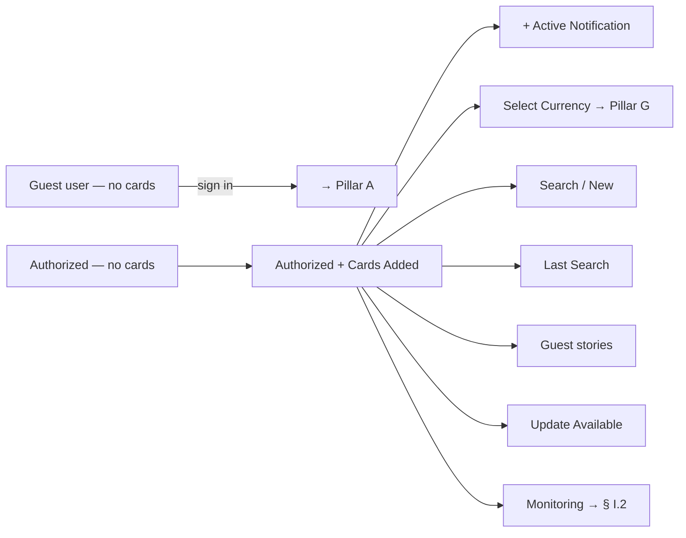
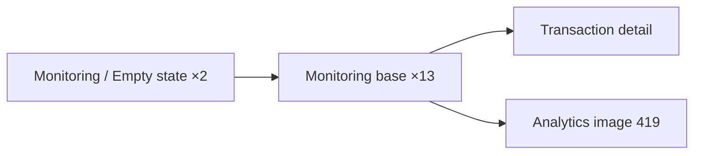
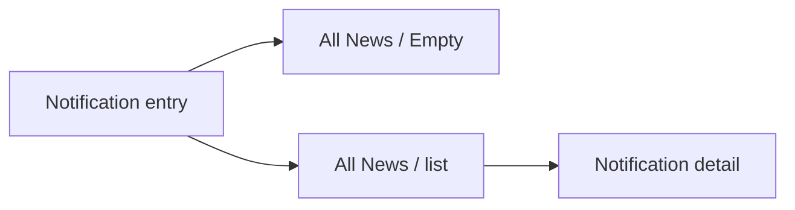
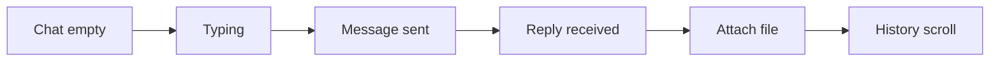
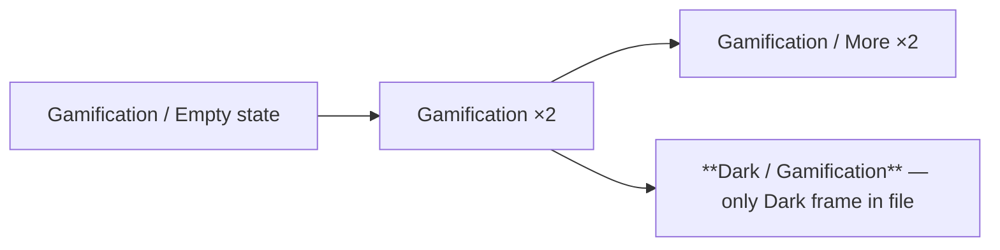
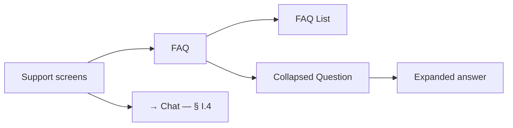

# 09 · Information & Engagement · Pillar I

Home (Main), transaction monitoring, news, in-app chat support, plus the
WIP support / FAQ, gamification, and stories surfaces. The connective
tissue between every other pillar — every flow starts from Main and most
end on Monitoring.

| Section | Page | Node ID | Frames | Status |
|---|---|---|---|---|
| Light / Main | Final Design | `9730:130203` | 18 | Final |
| Monitoring | Final Design | `19481:106128` | 16 | Final |
| Light / News & Push messages | Final Design | `13934:108807` | 3 | Final — thin |
| Chat | Final Design | `18921:95858` | 6 | Final |
| Stories (standalone) | Final Design | `21523:105023` | 1 | Thin |
| Notification img / Story mini-img (standalones) | Final Design | `21523:105075` / `21523:104977` | 2 | Asset |
| Light / Support screens | Working files | `10358:85629` | 3 + 2 | **WIP** |
| Gamification | Working files | `20917:117600` | 12 | **WIP — promote-ready** |
| Chat (duplicate) | Working files | `21534:131112` | 6 | Duplicate snapshot |

**Total: 46 Final + 23 WIP = 69 frames.**

---

## I.1 · Main / home

The dashboard. Every other pillar entry-point lives here.

Source: `Light / Main` (`9730:130203`). 18 frames.

### Variants table

| Variant | Frame ID | Notes |
|---|---|---|
| Guest user (no cards) | `9730:130204` | Pre-auth state |
| Guest tall scroll | `9730:130411` | h=1444 — full-page capture |
| Authorized | `9730:130248` | Logged in, no cards |
| Authorized + Cards Added | `10031:76934` | h=1402 — scrollable cards stack |
| Cards Added (variant) | `17752:130696` | |
| Cards Added (variant) | `18765:99886` | |
| + Active Notification | `9730:130306` | Banner / pill on top |
| Search / New | `9730:130364` | Empty search modal |
| Search / Last Search | `9730:130380` | Recent results |
| Search / Last Search (alt) | `9730:130397` | |
| Select Currency | `10031:77293` | See [§ G.2](./07_Currency_FX.md#g2--currency-selector-on-main) |
| Account / Guest / Stories | `10573:77975` | Guest-mode story preview |
| Account / Guest / Stories (alt) | `10573:77992` | |
| Update Available | `19692:106767` | h=808 — in-app update banner |
| Monitoring | `17688:104472` | Monitoring entry-point |
| Monitoring (tall) | `17688:110396` | h=1246 |
| Misc | Frame 314537 / 314550 | |

A standalone **Cards Added** capture exists at `11105:75477` (430×1821) —
treat as scrollable-content export, not phone viewport.

---

## I.2 · Transaction monitoring

Source: `Monitoring` (`19481:106128`). 16 frames.

| Group | Count |
|---|---|
| Light / Monitoring (base / list / states) | 13 |
| Light / Monitoring / Empty state | 2 |
| image 419 (analytics) | 1 |

The transaction list aggregates outputs from every payment + transfer
pillar. Cross-references back to UCash (Working files) and every cheque
section.

---

## I.3 · News & Push messages

Source: `Light / News & Push messages` (`13934:108807`). 3 frames — flagged
as **thin** (global plan §4.8).

| Frame |
|---|
| Light / All News |
| Light / Notification |
| Light / All News / Empty |

Notification thumbnail asset (standalone): `21523:105075` (303×170).

**Coverage gaps** flagged in global plan §4.8:
- No paginated state (next page / load-more)
- No filter (by category / read-unread)
- No error state (offline / failed-load)
- Likely needs unread-count + read-receipt patterns

---

## I.4 · Chat / in-app support

Source: `Chat` (`18921:95858`). 6 frames — all named `Light / Main /
Authorized User / Chat` with conversation-state variants.

State sequence is inferred from the 6-frame count; concrete frame names
are not differentiated in the audit beyond the shared parent name.

---

## I.5 · Stories (entry-point only)

Source: standalone `21523:105023` (Stories, 375×812).

A single full-screen Stories frame on Final Design — the surface exists as
an entry-point on Main (Account / Guest / Stories) and as an asset (Story
mini-img `21523:104977`, 88×64) but the **full Stories experience is not
built out**.

Decision (global plan §4.7): either build Stories or remove the entry-point.

---

## WIP / Working files

### I.6 · Gamification (WIP)

Source: `Gamification` (`20917:117600`). 12 frames. **Unique to Working
files** — no Final-Design counterpart.

| Frame | Notes |
|---|---|
| Group 38095 | Header / decoration |
| Light / Gamification / Empty state | First-time user |
| Light / Gamification (×2) | Active states |
| **Dark / Gamification** | **Only Dark variant on file** |
| Light / Gamification / More (×2) | Detail / drill-down |
| Group 38094 / 38096 | Decoration |
| Product Image (×3) | Reward visuals |

**Gotcha:** the lone `Dark / Gamification` frame is the only Dark
counterpart anywhere in the file. The `Color palette` variable collection
has Dark mode but `Main variables collection` does not — so Dark theming
is genuinely partial. See global-plan §4.4.

**Promote-ready** (global plan §5 Step 1).

### I.7 · Support / FAQ (WIP)

Source: `Light / Support screens` (`10358:85629`). 3 frames + 2
standalones. No Final-Design counterpart.

| Frame |
|---|
| Support screens (entry) |
| Support screens / FAQ |
| Support screens / FAQ / Collapsed Question |
| Standalone: `Light / Support Screen` |
| Standalone: `Light / Support Screen / FAQ List` |

Note that this section is **shared with Pillar F** because Support is also
a service-discovery surface (see
[06_Pay_Services.md § F.8](./06_Pay_Services.md#f8--support-screens-wip)).

### I.8 · Chat (duplicate)

Source: `Chat` on Working files (`21534:131112`). 6 frames — same names as
Final-Design Chat. Snapshot before promotion. Diff by ID before any
deletion.

---

## Open questions (from global plan §4)

1. **News & Push depth (§4.8)** — 3 frames is below typical coverage.
   Define the news feature's surface area before building. Add: empty-list,
   error, paginated, filter, unread-count.
2. **Stories (§4.7)** — only one frame on Final Design. Either build out
   the full Stories experience or remove the entry-point on Main.
3. **Dark mode policy (§4.4)** — only `Dark / Gamification` exists. Either
   commit to a full Dark theme (and audit `Main variables collection` which
   is Light-only) or remove the lone Dark frame.

---

## Reusable components

From `Unired_library_audit.md`:

- **Stories Item** (2) + **Stories Block** — Stories surface
- **Tab Item** (2) + **Tab** (2 single) — Monitoring / News tabs
- **Chat container** (2) — chat bubble pattern
- **Pie chart modul** (2) — Monitoring analytics
- **Progress circle** + **Progress Item** — Gamification streaks
- **Alert Info** (5 states) — banners / notifications
- **Badges** (2) — unread badges
- **Stars container** (6) — Rating UI in chat / support
- **Card** (2) — generic content-card
- **Status Icons** (17) — transaction-status glyphs
- **Monitoring icons** (6) — analytics chart icons
- **Loader** (8)
- **Bottom Menu** — see [00_Shared_flows § Bottom menu](./00_Shared_flows.md#bottom-menu)
